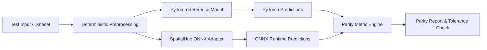

# Numerical Parity Verification

Numerical parity verification validates that exported ONNX model graphs execute identically to their baseline PyTorch implementations within predefined floating-point tolerances.

---

## Parity Verification Flow

When exporting models from PyTorch to ONNX Runtime, subtle numerical variations can emerge from operator decompositions, floating-point reordering, coordinate grid scaling, and runtime execution optimizations. The parity verification workflow assesses these differences systematically:



1. **Dual Initialization**: Instantiates both the baseline PyTorch reference model (in evaluation mode) and the target SpatialHub ONNX adapter on the identical execution device (e.g. CUDA).
2. **Deterministic Preprocessing**: Applies identical resizing, normalization, and padding pipelines to test inputs.
3. **Parallel Inference**: Feeds identical input tensors into both runtimes under `torch.no_grad()` and ONNX Runtime inference sessions.
4. **Metric Extraction**: Computes absolute error distributions across dense tensor predictions, confidence maps, camera pose extrinsics, and spatial keypoint coordinates.
5. **Tolerance Assessment**: Evaluates observed differences against strict numerical thresholds to confirm graph fidelity.

---

## Evaluation Metrics

Depending on the task domain and model architecture, parity verification evaluates dense predictions, multi-view camera geometry, or sparse coordinate sets:

### Dense Output Comparison

For dense predictions such as depth maps, surface normals, segmentation logits, and feature embeddings, error metrics are computed across all valid tensor elements:

$$
\text{MAE} = \frac{1}{N} \sum_{i=1}^{N} |y_{\text{pt}}^{(i)} - y_{\text{ort}}^{(i)}|
$$

$$
\text{Max Diff} = \max_{i} |y_{\text{pt}}^{(i)} - y_{\text{ort}}^{(i)}|
$$

$$
\text{Relative Error (\%)} = \frac{\text{MAE}}{\frac{1}{N} \sum_{i=1}^N |y_{\text{pt}}^{(i)}|} \times 100\%
$$

The relative error normalizes absolute residual magnitude by the mean signal magnitude, providing an invariant metric across different depth scales (relative vs. metric).

### Confidence Map Parity

For models providing pixel-level certainty or confidence masks:

$$
\text{Conf MAE} = \frac{1}{N} \sum_{i=1}^N |c_{\text{pt}}^{(i)} - c_{\text{ort}}^{(i)}|
$$

### Multi-View Camera Pose & Geometry

For models predicting camera trajectories and extrinsics $[R \mid t]$ (such as Depth Anything 3 multi-view decoders), parity evaluates rotation and translation components separately:

* **Geodesic Rotation Error ($^\circ$)**: Angular distance in $\mathrm{SO}(3)$ between PyTorch predicted rotation $R_{\text{pt}}$ and ONNX Runtime predicted rotation $R_{\text{ort}}$:

$$
\theta_{\text{rot}} = \arccos\left(\frac{\operatorname{Tr}(R_{\text{pt}} R_{\text{ort}}^T) - 1}{2}\right) \times \frac{180^\circ}{\pi}
$$

* **Translation Vector Error**: Euclidean distance between 3D camera translation vectors:

$$
e_{\text{trans}} = \|t_{\text{pt}} - t_{\text{ort}}\|_2 = \sqrt{\sum_{k=1}^3 (t_{\text{pt}, k} - t_{\text{ort}, k})^2}
$$

### Sparse / Keypoint Association

For models predicting variable-length coordinate sets (such as keypoint matching and sparse correspondence), coordinate ordering and match counts may vary slightly due to threshold boundary conditions.

Verification builds a $k$-d tree over the 4D coordinate space $(x_0, y_0, x_1, y_1)$ to establish one-to-one point correspondences within a distance radius $\tau$:

$$
d(\mathbf{p}_{\text{pt}}, \mathbf{p}_{\text{ort}}) = \|\mathbf{p}_{\text{pt}} - \mathbf{p}_{\text{ort}}\|_2 \le \tau
$$

Matched pairs are evaluated for coordinate Mean Absolute Error, coordinate Max Difference, and confidence score deviation:

$$
\text{Match Ratio} = \frac{\min(N_{\text{pt}}, N_{\text{ort}})}{\max(N_{\text{pt}}, N_{\text{ort}})}
$$

---

## Generic Verification Example

The following pattern illustrates numerical comparison between a PyTorch module and an ONNX Runtime session:

```python
import numpy as np
import onnxruntime as ort
import torch

def verify_dense_parity(
    pt_model: torch.nn.Module,
    ort_session: ort.InferenceSession,
    sample_input: np.ndarray,
    rtol: float = 1e-3,
    atol: float = 1e-4,
) -> dict[str, float | bool]:
    # PyTorch forward pass
    pt_tensor = torch.from_numpy(sample_input).cuda()
    with torch.no_grad():
        pt_output = pt_model(pt_tensor).cpu().numpy()

    # ONNX Runtime forward pass
    input_name = ort_session.get_inputs()[0].name
    ort_output = ort_session.run(None, {input_name: sample_input})[0]

    # Calculate error statistics
    abs_diff = np.abs(pt_output - ort_output)
    mae = float(np.mean(abs_diff))
    max_diff = float(np.max(abs_diff))
    rel_err = float(mae / (np.mean(np.abs(pt_output)) + 1e-7) * 100.0)
    passed = bool(np.allclose(pt_output, ort_output, rtol=rtol, atol=atol))

    return {
        "mae": mae,
        "max_diff": max_diff,
        "relative_error_pct": rel_err,
        "passed": passed,
    }
```

---

## Standalone Execution via `uv`

Parity scripts declare self-contained PyTorch, upstream, and ONNX Runtime dependencies via [PEP 723](https://peps.python.org/pep-0723/) inline metadata. They can be executed directly without altering the primary SpatialHub installation:

```bash
uv run tools/benchmark/parity_<model>.py [options]
```

---

## Common CLI Options

Parity verification utilities share standard command-line parameters:

| Parameter | Type | Default | Description |
| :--- | :--- | :--- | :--- |
| `--checkpoint` | `str \| None` | `None` | Path to reference PyTorch checkpoint (`.ckpt`, `.pt`, `.pth`). |
| `--model-dir` | `str \| None` | `None` | Path to directory containing local `.onnx` files. |
| `--variant` | `str` | `"all"` | Model variant or architecture configuration to verify. |
| `--view-counts` | `list[int]` | `[1, 2, 4]` | List of view counts to evaluate for multi-view models. |
| `--coord-tol` | `float` | `1e-2` | Maximum allowable coordinate difference in pixels. |
| `--conf-tol` | `float` | `1e-2` | Maximum allowable confidence score difference. |
| `--max-pairs` | `int \| None` | `None` | Optional cap on dataset evaluation samples. |
| `--output-file` | `str \| None` | `None` | Optional path to write formatted Markdown summary report. |
