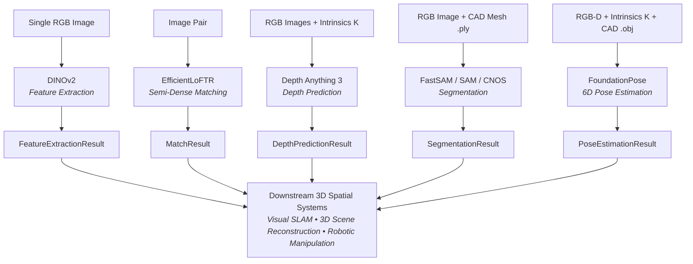

# SpatialHub Technical Documentation

**SpatialHub** is a lightweight, PyTorch-free spatial computing and perception library designed for modular inference, zero-configuration weight management, and unified Python API contracts built on **ONNX Runtime**.

---

## Motivation & Architecture

3D spatial vision and perception pipelines (such as 6D object pose estimation, Visual SLAM, and 3D scene reconstruction) are inherently multi-stage systems:

### Four-Tier Architecture Flow

1. **Sensor & Asset Inputs**: Accepts diverse input modalities ranging from raw monocular RGB frames, stereo pairs, and RGB-D streams with camera calibration matrices ($K$), to 3D CAD meshes (`.ply`, `.obj`).
2. **Perception Adapters (ONNX Runtime)**: Zero-PyTorch execution adapters with pure NumPy/OpenCV vector preprocessing and postprocessing.
3. **Standardized Return Contracts**: Universal, type-annotated dataclasses (`MatchResult`, `DepthPredictionResult`, etc.) establishing a consistent schema across all model families.
4. **Downstream 3D Spatial Systems**: Downstream geometric and spatial algorithms consume standardized dataclasses in a plug-and-play manner without model-specific coupling.

### The Multi-Stage Integration Problem

In conventional workflows, combining research models across these stages presents significant friction:

1. **Disparate Interface Contracts**: Every research model outputs different data structures, non-standard tensor shapes, and inconsistent coordinate conventions.
2. **Conflicting Dependencies**: Combining multiple neural models often causes severe PyTorch, CUDA, and library version conflicts.

### Plug-and-Play Modularity

SpatialHub addresses this by introducing **standardized return contracts** on top of a **zero-PyTorch ONNX Runtime engine**:

* **Interchangeable Models**: Any model producing a given dataclass (e.g. `MatchResult` or `DepthPredictionResult`) can be swapped into downstream pipelines without altering downstream geometric code.
* **Lightweight Deployment**: Core inference paths rely exclusively on ONNX Runtime with pure NumPy and OpenCV vector operations. PyTorch is isolated strictly to offline export utilities.

---

## Key Technical Specifications

* **Modular Return Contracts:** Standardized dataclass outputs ([`MatchResult`](core-and-utils/structures/match_result.md), [`DepthPredictionResult`](core-and-utils/structures/depth_prediction_result.md), [`FeatureExtractionResult`](core-and-utils/structures/feature_extraction_result.md), [`SegmentationResult`](core-and-utils/structures/segmentation_result.md), [`PoseEstimationResult`](core-and-utils/structures/pose_estimation_result.md)).
* **PyTorch-Free Inference Path:** Pure NumPy and OpenCV vector preprocessing and postprocessing. Inference engines execute exclusively on ONNX Runtime.
* **Automatic Weight Management:** Downloads, verifies, and caches pretrained `.onnx` weight binaries from Hugging Face Hub.
* **Execution Provider Configuration:** Supports CPU, CUDA, and TensorRT execution providers with runtime fallback verification.

---

## Perception Models Summary

| Model | Task | Returned Result Class | Export Script |
| :--- | :--- | :--- | :--- |
| [**EfficientLoFTR**](models/eloftr.md) | Semi-dense Feature Matching | [`MatchResult`](core-and-utils/structures/match_result.md) | `tools/export/export_efficient_loftr.py` |
| [**Depth Anything 3**](models/depthanything3.md) | Monocular & Multi-View Depth | [`DepthPredictionResult`](core-and-utils/structures/depth_prediction_result.md) | `tools/export/export_depth_anything_3.py` |
| [**DINOv2**](models/dinov2.md) | Image Feature Extraction | [`FeatureExtractionResult`](core-and-utils/structures/feature_extraction_result.md) | `tools/export/export_dinov2.py` |
| [**FastSAM**](models/fastsam.md) | Real-Time Proposal Segmentation | [`SegmentationResult`](core-and-utils/structures/segmentation_result.md) | `tools/export/export_fastsam.py` |
| [**SAM**](models/sam.md) | Automatic Mask Generation (AMG) | [`SegmentationResult`](core-and-utils/structures/segmentation_result.md) | `tools/export/export_sam.py` |
| [**CNOS**](models/cnos.md) | CAD Zero-Shot Object Detection | [`SegmentationResult`](core-and-utils/structures/segmentation_result.md) | `tools/export/export_dinov2.py` & `export_fastsam.py` |
| [**FoundationPose**](models/foundationpose.md) | Model-based 6D Object Pose & Tracking | [`PoseEstimationResult`](core-and-utils/structures/pose_estimation_result.md) | `tools/export/export_foundationpose.py` |