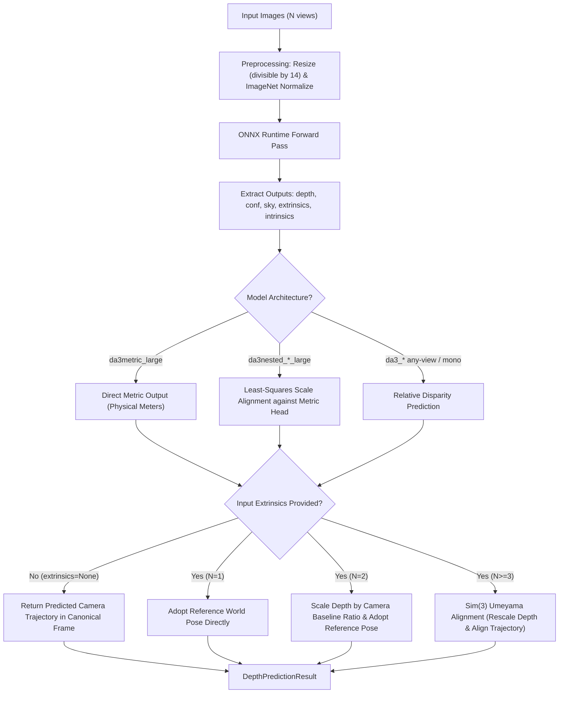

# Depth Anything 3 Technical Reference

`spatialhub.models.depth_anything_3` provides an ONNX Runtime adapter for **Depth Anything 3 (DA3)**, a foundation model series supporting monocular relative and metric depth estimation, multi-view camera pose alignment, and nested dual-model scale projection.

---

## Supported Model Presets & Series

The `DepthAnything3Adapter` accepts canonical model identifier strings, preset aliases, or multi-model sequences for nested pipelines via `model_name`:

### DA3 Any-View Foundation Series
Foundation models supporting single-image and multi-view sequences ($N \ge 1$), joint depth prediction, and relative camera pose estimation:

| Canonical Identifier | ONNX File | Parameter Count | Backbone Architecture | Primary Operational Role |
| :--- | :--- | :--- | :--- | :--- |
| `"da3_small"` | `da3_small.onnx` | ~25M | ViT-Small (DINOv2) | High-throughput, real-time edge processing and low-latency robotics. |
| `"da3_base"` (Default) | `da3_base.onnx` | ~98M | ViT-Base (DINOv2) | Balanced spatial accuracy and computational throughput. |
| `"da3_large"` | `da3_large.onnx` | ~335M | ViT-Large (DINOv2) | High-fidelity depth mapping and dense multi-view geometry. |
| `"da3_giant"` | `da3_giant.onnx` | ~1.35B | ViT-Giant (DINOv2) | Flagship foundation model with maximum geometric precision. |

### Specialized Monocular Variants
Single-image models fine-tuned for specific monocular tasks:

| Canonical Identifier | ONNX File | Parameter Count | Output Modality | Description |
| :--- | :--- | :--- | :--- | :--- |
| `"da3mono_large"` | `da3mono_large.onnx` | ~335M | Relative Depth + Sky Mask | High-resolution monocular relative depth with sky probability estimation. |
| `"da3metric_large"` | `da3metric_large.onnx` | ~335M | Metric Depth (Meters) | Direct absolute metric depth prediction using camera focal length scaling. |

### Nested Dual-Model Series
Combines the high-frequency geometric detail of an Any-View model with the physical scale of `da3metric_large` via least-squares scale-and-shift alignment:

| Canonical Identifier | Primary Model | Metric Reference | Primary Operational Role |
| :--- | :--- | :--- | :--- |
| `"da3nested_small_large"` | `da3_small.onnx` | `da3metric_large.onnx` | Lightweight metric estimation with high frame throughput. |
| `"da3nested_base_large"` | `da3_base.onnx` | `da3metric_large.onnx` | Balanced detail resolution and physical metric projection. |
| `"da3nested_large_large"` | `da3_large.onnx` | `da3metric_large.onnx` | High-fidelity dense metric reconstruction. |
| `"da3nested_giant_large"` | `da3_giant.onnx` | `da3metric_large.onnx` | Maximum visual fidelity projected to absolute metric units. |

---

## Preprocessing & Post-processing Flow

Depth Anything 3 processes an input sequence of $N$ images, producing aligned depth maps, confidence masks, and optional camera trajectory transformations.



### Dimension Resizing & Normalization

Inputs are scaled to spatial dimensions $(W, H)$ that are positive integer multiples of the ViT patch size $14$:

$$
W = 14 \cdot \left\lfloor \frac{W_{\text{target}}}{14} \right\rfloor, \qquad H = 14 \cdot \left\lfloor \frac{H_{\text{target}}}{14} \right\rfloor
$$

Pixel color channels are normalized using standard ImageNet mean $\mu$ and standard deviation $\sigma$:

$$
x_{\text{norm}} = \frac{\frac{x}{255.0} - \mu}{\sigma}, \qquad \mu = [0.485, 0.456, 0.406], \quad \sigma = [0.229, 0.224, 0.225]
$$

### Depth Output Modalities & Scale Projection

Depth Anything 3 supports three depth output modes:

* **Relative Depth (`da3_small`, `da3_base`, `da3_large`, `da3_giant`, `da3mono_large`)**: Foundation models output non-metric relative depth maps. `da3mono_large` additionally outputs a binary-thresholded sky segmentation mask $M_{\text{sky}}$ where non-zero pixels represent sky regions.
* **Standalone Metric Depth (`da3metric_large`)**: Directly predicts dense depth maps in physical meters without requiring post-hoc focal normalization.
* **Nested Dual-Model Metric Projection (`da3nested_*_large`)**: Combines the high-frequency geometric detail of an Any-View model ($D_{\text{rel}}$) with the absolute physical scale of `da3metric_large` ($D_{\text{metric}}$). A closed-form linear least-squares scale parameter $s^*$ is calculated over high-confidence, non-sky pixels $\Omega$:

$$
\Omega = \{ (u, v) \mid C_{\text{rel}}(u, v) > \tau_{\text{conf}} \land M_{\text{sky}}(u, v) \le 0.5 \}
$$

$$
s^* = \arg\min_s \sum_{(u, v) \in \Omega} \left( s \cdot D_{\text{rel}}(u, v) - D_{\text{metric}}(u, v) \right)^2 = \frac{\sum_{(u, v) \in \Omega} D_{\text{rel}}(u, v) \cdot D_{\text{metric}}(u, v)}{\sum_{(u, v) \in \Omega} D_{\text{rel}}(u, v)^2}
$$

$$
D_{\text{aligned}} = s^* \cdot D_{\text{rel}}
$$

### Camera Calibration & Trajectory Alignment

The adapter handles camera intrinsics and extrinsics dynamically based on whether input poses are provided:

```
+----------------------------------------------------------------------------------------------------+
|                                    CAMERA PARAMETER FLOW                                           |
+----------------------------------------------------------------------------------------------------+
|  Input Parameter      |  Execution Mode    |  Behavior & Depth Scaling   |  Returned Result        |
+-----------------------+--------------------+-----------------------------+-------------------------+
|  extrinsics = None    |  Unposed Sequence  |  Camera decoder estimates   |  result.extrinsics      |
|                       |                    |  relative camera poses      |  contains predicted     |
|                       |                    |  in internal canonical      |  trajectory (N, 4, 4)   |
|                       |                    |  coordinate frame.          |                         |
+-----------------------+--------------------+-----------------------------+-------------------------+
|  extrinsics provided  |  Posed Single-View |  No scaling performed.      |  result.extrinsics      |
|  (N = 1)              |  (N = 1)           |  Input world pose adopted.  |  matches input pose.    |
+-----------------------+--------------------+-----------------------------+-------------------------+
|  extrinsics provided  |  Posed Two-View    |  Scale computed from camera |  Depth scaled by 1/s;   |
|  (N = 2)              |  (N = 2)           |  center baseline ratio:     |  result.extrinsics      |
|                       |                    |  s = ||ΔC_pred|| / ||ΔC_gt|||  matches input poses.   |
+-----------------------+--------------------+-----------------------------+-------------------------+
|  extrinsics provided  |  Posed Multi-View  |  Umeyama Sim(3) fit aligns  |  Depth scaled by 1/s;   |
|  (N >= 3)             |  (N >= 3)          |  predicted trajectory to GT |  result.extrinsics      |
|                       |                    |  (with RANSAC if N >= 10).  |  matches input poses.   |
+-----------------------+--------------------+-----------------------------+-------------------------+
|  intrinsics = None    |  Uncalibrated      |  Pinhole focal & principal  |  result.intrinsics      |
|                       |                    |  points estimated by head.  |  contains (N, 3, 3).    |
+-----------------------+--------------------+-----------------------------+-------------------------+
|  intrinsics provided  |  Calibrated        |  Model conditioned on input |  result.intrinsics      |
|                       |                    |  calibration parameters.    |  contains (N, 3, 3).    |
+----------------------------------------------------------------------------------------------------+
```

#### Trajectory Alignment Modes

When reference camera extrinsics $T_{\text{ref}} = [R \mid t] \in \mathrm{SE}(3)$ are provided:

**Single-View ($N = 1$)**: Direct assignment of the reference world coordinate frame:

$$
T_{\text{aligned}} = T_{\text{ref}}
$$

**Two-View ($N = 2$)**: True 3D camera optical centers in world coordinates $C = T_{\text{w2c}}^{-1}[:3, 3]$ are computed for both reference and predicted poses. Depth and translation are scaled by the baseline distance ratio:

$$
s_{\text{baseline}} = \frac{\|C_{\text{pred}, 2} - C_{\text{pred}, 1}\|_2}{\|C_{\text{ref}, 2} - C_{\text{ref}, 1}\|_2}, \qquad D_{\text{aligned}} = \frac{D_{\text{pred}}}{s_{\text{baseline}}}
$$

**Multi-View ($N \ge 3$)**: A rigid similarity transformation $(R^*, t^*, s^*) \in \mathrm{Sim}(3)$ is computed via Umeyama SVD factorization (with optional RANSAC for outlier suppression on $N \ge 10$ views):

$$
\min_{R \in \mathrm{SO}(3),\, t \in \mathbb{R}^3,\, s > 0} \sum_{i=1}^N \left\| s R C_{\text{pred}, i} + t - C_{\text{ref}, i} \right\|_2^2, \qquad D_{\text{aligned}} = \frac{D_{\text{pred}}}{s^*}
$$

**Unposed Trajectory Evaluation (`align_to_input_ext_scale=False`)**: When evaluating raw camera decoder drift against ground truth without locking poses to the input, setting `align_to_input_ext_scale=False` outputs the Umeyama-aligned predicted trajectory $T_{\text{aligned}}$ directly without overwriting with $T_{\text{ref}}$.

---

## Numerical Parity Verification

Evaluates numerical agreement between PyTorch reference checkpoints and the SpatialHub ONNX Runtime adapter on the HiRoom evaluation dataset at $504 \times 504$ resolution.

### Any-View Foundation Series

Comparison across single-view ($N=1$) and multi-view ($N=2, 4$) sequences:

<table>
  <thead>
    <tr>
      <th>Model Variant</th>
      <th>Views ($N$)</th>
      <th>Depth MAE</th>
      <th>Depth Max Diff</th>
      <th>Relative Error (%)</th>
      <th>Conf MAE</th>
      <th>Extrinsics Rot Error (PT vs ORT)</th>
      <th>Extrinsics Trans Error (PT vs ORT)</th>
    </tr>
  </thead>
  <tbody>
    <tr>
      <td rowspan="3" style="vertical-align: middle; text-align: center; font-weight: bold; border-right: 2px solid #ddd;"><code>da3_small</code></td>
      <td>1</td>
      <td>0.000096</td>
      <td>0.001976</td>
      <td><strong>0.01%</strong></td>
      <td>0.001233</td>
      <td>0.0000°</td>
      <td>0.000000</td>
    </tr>
    <tr>
      <td>2</td>
      <td>0.001272</td>
      <td>0.085482</td>
      <td><strong>0.04%</strong></td>
      <td>0.014252</td>
      <td>0.0000°</td>
      <td>0.000000</td>
    </tr>
    <tr style="border-bottom: 2px solid #ccc;">
      <td>4</td>
      <td>0.004254</td>
      <td>0.246895</td>
      <td><strong>0.05%</strong></td>
      <td>0.000582</td>
      <td>0.0000°</td>
      <td>0.000000</td>
    </tr>
    <tr>
      <td rowspan="3" style="vertical-align: middle; text-align: center; font-weight: bold; border-right: 2px solid #ddd;"><code>da3_base</code></td>
      <td>1</td>
      <td>0.000044</td>
      <td>0.002224</td>
      <td><strong>0.00%</strong></td>
      <td>0.003377</td>
      <td>0.0000°</td>
      <td>0.000000</td>
    </tr>
    <tr>
      <td>2</td>
      <td>0.001764</td>
      <td>0.081946</td>
      <td><strong>0.06%</strong></td>
      <td>0.021171</td>
      <td>0.0000°</td>
      <td>0.000000</td>
    </tr>
    <tr style="border-bottom: 2px solid #ccc;">
      <td>4</td>
      <td>0.002598</td>
      <td>0.281878</td>
      <td><strong>0.03%</strong></td>
      <td>0.000913</td>
      <td>0.0000°</td>
      <td>0.000000</td>
    </tr>
    <tr>
      <td rowspan="3" style="vertical-align: middle; text-align: center; font-weight: bold; border-right: 2px solid #ddd;"><code>da3_large</code></td>
      <td>1</td>
      <td>0.000050</td>
      <td>0.002824</td>
      <td><strong>0.00%</strong></td>
      <td>0.004860</td>
      <td>0.0000°</td>
      <td>0.000000</td>
    </tr>
    <tr>
      <td>2</td>
      <td>0.002046</td>
      <td>0.098485</td>
      <td><strong>0.06%</strong></td>
      <td>0.016927</td>
      <td>0.0000°</td>
      <td>0.000000</td>
    </tr>
    <tr style="border-bottom: 2px solid #ccc;">
      <td>4</td>
      <td>0.006935</td>
      <td>0.441951</td>
      <td><strong>0.09%</strong></td>
      <td>0.001602</td>
      <td>0.0000°</td>
      <td>0.000000</td>
    </tr>
    <tr>
      <td rowspan="3" style="vertical-align: middle; text-align: center; font-weight: bold; border-right: 2px solid #ddd;"><code>da3_giant</code></td>
      <td>1</td>
      <td>0.000188</td>
      <td>0.005118</td>
      <td><strong>0.00%</strong></td>
      <td>0.004523</td>
      <td>0.0000°</td>
      <td>0.000000</td>
    </tr>
    <tr>
      <td>2</td>
      <td>0.001602</td>
      <td>0.084178</td>
      <td><strong>0.04%</strong></td>
      <td>0.021703</td>
      <td>0.0000°</td>
      <td>0.000000</td>
    </tr>
    <tr style="border-bottom: 2px solid #ccc;">
      <td>4</td>
      <td>0.020584</td>
      <td>1.637156</td>
      <td><strong>0.23%</strong></td>
      <td>0.008453</td>
      <td>0.0000°</td>
      <td>0.000000</td>
    </tr>
  </tbody>
</table>

### Specialized Monocular Series

Single-view ($N=1$) parity evaluation:

<table>
  <thead>
    <tr>
      <th>Model Variant</th>
      <th>Views ($N$)</th>
      <th>Depth MAE</th>
      <th>Depth Max Diff</th>
      <th>Relative Error (%)</th>
      <th>Output Modality</th>
    </tr>
  </thead>
  <tbody>
    <tr>
      <td style="vertical-align: middle; text-align: center; font-weight: bold; border-right: 2px solid #ddd;"><code>da3mono_large</code></td>
      <td>1</td>
      <td>0.000062</td>
      <td>0.008396</td>
      <td><strong>0.01%</strong></td>
      <td>Relative Depth + Sky Mask</td>
    </tr>
    <tr style="border-bottom: 2px solid #ccc;">
      <td style="vertical-align: middle; text-align: center; font-weight: bold; border-right: 2px solid #ddd;"><code>da3metric_large</code></td>
      <td>1</td>
      <td>0.000120</td>
      <td>0.008575</td>
      <td><strong>0.00%</strong></td>
      <td>Metric Depth (Meters)</td>
    </tr>
  </tbody>
</table>

### Nested Dual-Model Series

Single-view ($N=1$) parity evaluation for dual-session scale projection:

<table>
  <thead>
    <tr>
      <th>Model Variant</th>
      <th>Views ($N$)</th>
      <th>Depth MAE</th>
      <th>Depth Max Diff</th>
      <th>Relative Error (%)</th>
      <th>Conf MAE</th>
      <th>Extrinsics Rot Error (PT vs ORT)</th>
      <th>Extrinsics Trans Error (PT vs ORT)</th>
    </tr>
  </thead>
  <tbody>
    <tr>
      <td style="vertical-align: middle; text-align: center; font-weight: bold; border-right: 2px solid #ddd;"><code>da3nested_small_large</code></td>
      <td>1</td>
      <td>0.000593</td>
      <td>0.006289</td>
      <td><strong>0.02%</strong></td>
      <td>0.001255</td>
      <td>0.0000°</td>
      <td>0.000000</td>
    </tr>
    <tr>
      <td style="vertical-align: middle; text-align: center; font-weight: bold; border-right: 2px solid #ddd;"><code>da3nested_base_large</code></td>
      <td>1</td>
      <td>0.000351</td>
      <td>0.007988</td>
      <td><strong>0.01%</strong></td>
      <td>0.003424</td>
      <td>0.0000°</td>
      <td>0.000000</td>
    </tr>
    <tr>
      <td style="vertical-align: middle; text-align: center; font-weight: bold; border-right: 2px solid #ddd;"><code>da3nested_large_large</code></td>
      <td>1</td>
      <td>0.000620</td>
      <td>0.008171</td>
      <td><strong>0.02%</strong></td>
      <td>0.004896</td>
      <td>0.0000°</td>
      <td>0.000000</td>
    </tr>
    <tr style="border-bottom: 2px solid #ccc;">
      <td style="vertical-align: middle; text-align: center; font-weight: bold; border-right: 2px solid #ddd;"><code>da3nested_giant_large</code></td>
      <td>1</td>
      <td>0.004001</td>
      <td>0.019733</td>
      <td><strong>0.13%</strong></td>
      <td>0.005890</td>
      <td>0.0000°</td>
      <td>0.000000</td>
    </tr>
  </tbody>
</table>

To execute local parity testing:

```bash
uv run tools/benchmark/parity_depth_anything_3.py \
    --variant all \
    --view-counts 1 2 4 \
    --output-file .profile/parity_da3.md
```

---

## Performance Benchmarks

Latencies, throughput, host process RAM deltas, and peak device VRAM footprint measured on the HiRoom evaluation dataset at $504 \times 504$ resolution.

### Test Environment & Hardware Specification
* **Operating System**: Windows 11 (64-bit)
* **GPU**: NVIDIA GeForce RTX (8,192 MB GDDR6 physical VRAM, CUDA Execution Provider)
* **CPU**: Multi-core x86_64 host processor (`CPUExecutionProvider`)
* **ONNX Runtime**: 1.20.1 with native CUDA driver synchronization (`cuCtxSynchronize`) and memory telemetry (`cuMemGetInfo_v2`)
* **Evaluation Dataset**: HiRoom multi-view benchmark scene (`504 x 504` spatial resolution)

### Any-View Foundation Series

=== "CUDA Execution (`CUDAExecutionProvider`)"

    <table>
      <thead>
        <tr>
          <th>Model Variant</th>
          <th>Views ($N$)</th>
          <th>Preprocess (ms)</th>
          <th>Inference (ms)</th>
          <th>Postprocess (ms)</th>
          <th>End-to-End Latency (ms)</th>
          <th>Throughput (FPS)</th>
          <th>Peak Host RAM</th>
          <th>Peak VRAM</th>
        </tr>
      </thead>
      <tbody>
        <tr>
          <td rowspan="3" style="vertical-align: middle; text-align: center; font-weight: bold; border-right: 2px solid #ddd;"><code>da3_small</code></td>
          <td>1</td>
          <td>13.96 +/- 0.82</td>
          <td>39.20 +/- 1.98</td>
          <td>0.01 +/- 0.01</td>
          <td>58.33 +/- 1.83</td>
          <td><strong>17.1</strong></td>
          <td>+0.7 MB</td>
          <td>0.0 MB</td>
        </tr>
        <tr>
          <td>2</td>
          <td>51.95 +/- 10.96</td>
          <td>77.99 +/- 4.08</td>
          <td>0.85 +/- 0.15</td>
          <td>116.03 +/- 5.00</td>
          <td><strong>8.6</strong></td>
          <td>+0.0 MB</td>
          <td>0.0 MB</td>
        </tr>
        <tr style="border-bottom: 2px solid #ccc;">
          <td>4</td>
          <td>82.83 +/- 12.02</td>
          <td>193.91 +/- 13.96</td>
          <td>1.97 +/- 0.35</td>
          <td>262.47 +/- 24.91</td>
          <td><strong>3.8</strong></td>
          <td>0.0 MB</td>
          <td>0.0 MB</td>
        </tr>
        <tr>
          <td rowspan="3" style="vertical-align: middle; text-align: center; font-weight: bold; border-right: 2px solid #ddd;"><code>da3_base</code></td>
          <td>1</td>
          <td>13.82 +/- 0.67</td>
          <td>76.25 +/- 5.51</td>
          <td>0.01 +/- 0.01</td>
          <td>103.08 +/- 9.25</td>
          <td><strong>9.7</strong></td>
          <td>+0.8 MB</td>
          <td>0.0 MB</td>
        </tr>
        <tr>
          <td>2</td>
          <td>72.23 +/- 11.20</td>
          <td>169.50 +/- 11.35</td>
          <td>0.58 +/- 0.05</td>
          <td>187.15 +/- 4.59</td>
          <td><strong>5.3</strong></td>
          <td>+0.0 MB</td>
          <td>0.0 MB</td>
        </tr>
        <tr style="border-bottom: 2px solid #ccc;">
          <td>4</td>
          <td>57.28 +/- 3.67</td>
          <td>1365.62 +/- 165.21</td>
          <td>1.47 +/- 0.46</td>
          <td>1353.29 +/- 52.77</td>
          <td><strong>0.7</strong></td>
          <td>+0.0 MB</td>
          <td>0.0 MB</td>
        </tr>
        <tr>
          <td rowspan="2" style="vertical-align: middle; text-align: center; font-weight: bold; border-right: 2px solid #ddd;"><code>da3_large</code></td>
          <td>1</td>
          <td>14.22 +/- 0.50</td>
          <td>228.33 +/- 19.53</td>
          <td>0.06 +/- 0.06</td>
          <td>234.59 +/- 23.27</td>
          <td><strong>4.3</strong></td>
          <td>+0.0 MB</td>
          <td>0.0 MB</td>
        </tr>
        <tr style="border-bottom: 2px solid #ccc;">
          <td>2</td>
          <td>44.06 +/- 3.62</td>
          <td>726.08 +/- 48.28</td>
          <td>1.84 +/- 0.91</td>
          <td>962.20 +/- 75.71</td>
          <td><strong>1.0</strong></td>
          <td>+0.0 MB</td>
          <td>0.0 MB</td>
        </tr>
        <tr style="border-bottom: 2px solid #ccc;">
          <td style="vertical-align: middle; text-align: center; font-weight: bold; border-right: 2px solid #ddd;"><code>da3_giant</code></td>
          <td>1</td>
          <td>41.60 +/- 5.47</td>
          <td>754.94 +/- 61.63</td>
          <td>0.01 +/- 0.00</td>
          <td>1047.74 +/- 75.55</td>
          <td><strong>1.0</strong></td>
          <td>+0.8 MB</td>
          <td>0.0 MB</td>
        </tr>
      </tbody>
    </table>

=== "CPU Execution (`CPUExecutionProvider`)"

    <table>
      <thead>
        <tr>
          <th>Model Variant</th>
          <th>Views ($N$)</th>
          <th>Preprocess (ms)</th>
          <th>Inference (ms)</th>
          <th>Postprocess (ms)</th>
          <th>End-to-End Latency (ms)</th>
          <th>Throughput (FPS)</th>
          <th>Peak Host RAM</th>
        </tr>
      </thead>
      <tbody>
        <tr>
          <td rowspan="3" style="vertical-align: middle; text-align: center; font-weight: bold; border-right: 2px solid #ddd;"><code>da3_small</code></td>
          <td>1</td>
          <td>20.46 +/- 1.67</td>
          <td>963.35 +/- 54.34</td>
          <td>0.01 +/- 0.00</td>
          <td>938.11 +/- 55.05</td>
          <td><strong>1.1</strong></td>
          <td>0.0 MB</td>
        </tr>
        <tr>
          <td>2</td>
          <td>32.12 +/- 1.96</td>
          <td>1751.34 +/- 103.10</td>
          <td>0.94 +/- 0.10</td>
          <td>1667.54 +/- 100.63</td>
          <td><strong>0.6</strong></td>
          <td>0.0 MB</td>
        </tr>
        <tr style="border-bottom: 2px solid #ccc;">
          <td>4</td>
          <td>66.58 +/- 6.18</td>
          <td>4071.60 +/- 231.29</td>
          <td>1.97 +/- 0.29</td>
          <td>3765.84 +/- 44.92</td>
          <td><strong>0.3</strong></td>
          <td>0.0 MB</td>
        </tr>
        <tr>
          <td rowspan="2" style="vertical-align: middle; text-align: center; font-weight: bold; border-right: 2px solid #ddd;"><code>da3_base</code></td>
          <td>1</td>
          <td>15.52 +/- 0.95</td>
          <td>2961.53 +/- 268.82</td>
          <td>0.01 +/- 0.00</td>
          <td>3194.21 +/- 203.55</td>
          <td><strong>0.3</strong></td>
          <td>+0.2 MB</td>
        </tr>
        <tr style="border-bottom: 2px solid #ccc;">
          <td>2</td>
          <td>57.91 +/- 6.61</td>
          <td>5583.48 +/- 665.50</td>
          <td>1.68 +/- 0.55</td>
          <td>5054.75 +/- 203.03</td>
          <td><strong>0.2</strong></td>
          <td>+0.0 MB</td>
        </tr>
      </tbody>
    </table>

### Specialized Monocular Series

=== "CUDA Execution (`CUDAExecutionProvider`)"

    <table>
      <thead>
        <tr>
          <th>Model Variant</th>
          <th>Views ($N$)</th>
          <th>Preprocess (ms)</th>
          <th>Inference (ms)</th>
          <th>Postprocess (ms)</th>
          <th>End-to-End Latency (ms)</th>
          <th>Throughput (FPS)</th>
          <th>Peak Host RAM</th>
          <th>Peak VRAM</th>
        </tr>
      </thead>
      <tbody>
        <tr>
          <td style="vertical-align: middle; text-align: center; font-weight: bold; border-right: 2px solid #ddd;"><code>da3mono_large</code></td>
          <td>1</td>
          <td>19.64 +/- 1.65</td>
          <td>334.38 +/- 82.16</td>
          <td>0.76 +/- 0.37</td>
          <td>436.41 +/- 66.33</td>
          <td><strong>2.3</strong></td>
          <td>+0.0 MB</td>
          <td>0.0 MB</td>
        </tr>
        <tr style="border-bottom: 2px solid #ccc;">
          <td style="vertical-align: middle; text-align: center; font-weight: bold; border-right: 2px solid #ddd;"><code>da3metric_large</code></td>
          <td>1</td>
          <td>17.31 +/- 0.61</td>
          <td>424.25 +/- 45.61</td>
          <td>1.24 +/- 0.48</td>
          <td>592.29 +/- 55.65</td>
          <td><strong>1.7</strong></td>
          <td>0.0 MB</td>
          <td>0.0 MB</td>
        </tr>
      </tbody>
    </table>

=== "CPU Execution (`CPUExecutionProvider`)"

    <table>
      <thead>
        <tr>
          <th>Model Variant</th>
          <th>Views ($N$)</th>
          <th>Preprocess (ms)</th>
          <th>Inference (ms)</th>
          <th>Postprocess (ms)</th>
          <th>End-to-End Latency (ms)</th>
          <th>Throughput (FPS)</th>
          <th>Peak Host RAM</th>
        </tr>
      </thead>
      <tbody>
        <tr>
          <td style="vertical-align: middle; text-align: center; font-weight: bold; border-right: 2px solid #ddd;"><code>da3mono_large</code></td>
          <td>1</td>
          <td>19.34 +/- 1.31</td>
          <td>6971.38 +/- 273.14</td>
          <td>0.99 +/- 0.29</td>
          <td>6814.43 +/- 282.94</td>
          <td><strong>0.1</strong></td>
          <td>+0.0 MB</td>
        </tr>
        <tr style="border-bottom: 2px solid #ccc;">
          <td style="vertical-align: middle; text-align: center; font-weight: bold; border-right: 2px solid #ddd;"><code>da3metric_large</code></td>
          <td>1</td>
          <td>17.87 +/- 1.31</td>
          <td>7032.86 +/- 954.40</td>
          <td>1.07 +/- 0.11</td>
          <td>6407.92 +/- 350.31</td>
          <td><strong>0.2</strong></td>
          <td>+0.0 MB</td>
        </tr>
      </tbody>
    </table>

### Nested Dual-Model Series (Single-View, CUDA)

Evaluates sequential dual-session forward execution (`main_session` + `da3metric_large`) with least-squares scale alignment ($N=1$):

<table>
  <thead>
    <tr>
      <th>Variant</th>
      <th>Primary Backbone</th>
      <th>Metric Backbone</th>
      <th>Inference Latency (ms)</th>
      <th>Postprocess (ms)</th>
      <th>End-to-End Latency (ms)</th>
      <th>Throughput (FPS)</th>
      <th>Peak Host RAM</th>
    </tr>
  </thead>
  <tbody>
    <tr>
      <td style="vertical-align: middle; text-align: center; font-weight: bold; border-right: 2px solid #ddd;"><code>da3nested_small_large</code></td>
      <td>ViT-Small (~25M)</td>
      <td>ViT-Large (~335M)</td>
      <td>513.84 +/- 57.57</td>
      <td>8.50 +/- 0.79</td>
      <td>616.72 +/- 33.63</td>
      <td><strong>1.6</strong></td>
      <td>+0.0 MB</td>
    </tr>
    <tr>
      <td style="vertical-align: middle; text-align: center; font-weight: bold; border-right: 2px solid #ddd;"><code>da3nested_base_large</code></td>
      <td>ViT-Base (~98M)</td>
      <td>ViT-Large (~335M)</td>
      <td>1340.01 +/- 316.71</td>
      <td>21.79 +/- 0.55</td>
      <td>1922.75 +/- 344.29</td>
      <td><strong>0.5</strong></td>
      <td>+0.1 MB</td>
    </tr>
    <tr>
      <td style="vertical-align: middle; text-align: center; font-weight: bold; border-right: 2px solid #ddd;"><code>da3nested_large_large</code></td>
      <td>ViT-Large (~335M)</td>
      <td>ViT-Large (~335M)</td>
      <td>2710.09 +/- 419.06</td>
      <td>12.83 +/- 1.02</td>
      <td>4981.45 +/- 853.61</td>
      <td><strong>0.2</strong></td>
      <td>0.0 MB</td>
    </tr>
    <tr style="border-bottom: 2px solid #ccc;">
      <td style="vertical-align: middle; text-align: center; font-weight: bold; border-right: 2px solid #ddd;"><code>da3nested_giant_large</code> *</td>
      <td>ViT-Giant (~1.35B)</td>
      <td>ViT-Large (~335M)</td>
      <td>93813.10 +/- 59742.51</td>
      <td>11.00 +/- 0.34</td>
      <td>34528.18 +/- 2626.51</td>
      <td><strong>0.03</strong></td>
      <td>+220.2 MB</td>
    </tr>
  </tbody>
</table>

> [!WARNING]
> **VRAM Footprint Note on `da3nested_giant_large`**:
> The concurrent active parameter footprint of ViT-Giant (~5.4 GB weights) and ViT-Large (~1.4 GB weights) along with intermediate attention activation tensors exceeds the 8,192 MB physical VRAM capacity of the test GPU. On Windows WDDM, excess tensors are paged across the PCIe bus into host shared RAM, resulting in elevated inference latency. For dual-model ViT-Giant deployment, a hardware device with $\ge 16\text{ GB}$ dedicated VRAM is recommended.

---

## SpatialHub Adapter API & Usage

### Single-View Relative Depth Estimation

```python
import cv2
from spatialhub import DepthAnything3

# Initialize adapter with DA3 Base preset
with DepthAnything3(model_name="da3_base", providers=["CUDAExecutionProvider"]) as estimator:
    result = estimator.estimate_depth(images=["room_view.jpg"])

    # Visualize colorized depth map
    colorized_depth = estimator.visualize(result.depth[0])
    cv2.imwrite("depth_output.png", cv2.cvtColor(colorized_depth, cv2.COLOR_RGB2BGR))
```

### Multi-View Trajectory Alignment & Depth Scaling

```python
from spatialhub import DepthAnything3

with DepthAnything3(
    model_name="da3_large",
    align_to_input_ext_scale=True,
    ransac_view_thresh=10,
    providers=["CUDAExecutionProvider"],
) as estimator:
    result = estimator.estimate_depth(
        images=["view_01.jpg", "view_02.jpg", "view_03.jpg", "view_04.jpg"],
        extrinsics=reference_extrinsics,
    )

    print("Estimated depth shape:", result.depth.shape)
    print("Aligned camera extrinsics shape:", result.extrinsics.shape)
```

### Direct Metric Depth Estimation

```python
from spatialhub import DepthAnything3

# Direct absolute metric depth prediction (meters)
with DepthAnything3(model_name="da3metric_large", providers=["CUDAExecutionProvider"]) as estimator:
    result = estimator.estimate_depth(images=["indoor_scene.jpg"])
    print("Metric depth output range (meters):", result.depth.min(), result.depth.max())
```

### Nested Dual-Model Metric Projection

```python
from spatialhub import DepthAnything3

# Combine ViT-Base geometric detail with ViT-Large physical metric scale
with DepthAnything3(model_name="da3nested_base_large", providers=["CUDAExecutionProvider"]) as estimator:
    result = estimator.estimate_depth(images=["indoor_scene.jpg"])
    print("Metric depth output range (meters):", result.depth.min(), result.depth.max())
```

---

## Tooling & Verification Commands

=== "Export ONNX"
    Export pretrained PyTorch Depth Anything 3 checkpoints to ONNX graphs:

    ```bash
    uv run tools/export/export_depth_anything_3.py \
        --variant base \
        --output-folder onnx_weight \
        --width 504 \
        --height 504 \
        --opset 18 \
        --device cpu
    ```

    | Parameter | Type | Default | Description |
    | :--- | :--- | :--- | :--- |
    | `--variant` | `str` | `"all"` | Target model variant (`small`, `base`, `large`, `giant`, `mono_large`, `metric_large`, or `all`). |
    | `--model-name` | `str` | `None` | Optional Hugging Face repo ID or local checkpoint path to export directly. |
    | `--output-folder` | `str` | `onnx_weight` | Destination directory for exported `.onnx` model files. |
    | `--width` | `int` | `504` | Input image width in pixels (must be a multiple of 14, $\ge 392$). |
    | `--height` | `int` | `504` | Input image height in pixels (must be a multiple of 14, $\ge 392$). |
    | `--opset` | `int` | `18` | ONNX Operator Set version. |
    | `--device` | `str` | `"cpu"` | Tracing device (`cpu` or `cuda`). |

=== "Parity Check"
    Validate numerical depth and camera trajectory parity against PyTorch reference:

    ```bash
    uv run tools/benchmark/parity_depth_anything_3.py \
        --variant all \
        --view-counts 1 2 4 \
        --dataset-dir .cache/hiroom \
        --output-file .profile/parity_da3.md
    ```

    | Parameter | Type | Default | Description |
    | :--- | :--- | :--- | :--- |
    | `--variant` | `str` | `"all"` | Target model variant (`small`, `base`, `large`, `giant`, `mono_large`, `metric_large`, `nested_*`, or `all`). |
    | `--view-counts` | `list[int]` | `[1, 2, 4]` | Sequence view counts to evaluate ($N=1$ for single-view, $N \ge 2$ for multi-view). |
    | `--dataset-dir` | `str` | `None` | Path to extracted HiRoom benchmark dataset directory (defaults to `.cache/hiroom`). |
    | `--model-dir` | `str` | `None` | Optional directory containing local `.onnx` model weight files. |
    | `--output-file` | `str` | `None` | Optional file path to save Markdown parity summary table. |

=== "Performance Profile"
    Benchmark pipeline stage latency, throughput, and memory footprint:

    ```bash
    uv run tools/benchmark/profile_depth_anything_3.py \
        --variant da3_small \
        --provider all \
        --process-res 504 \
        --view-counts 1 2 4 \
        --warmup 3 \
        --iterations 10 \
        --dataset-dir .cache/hiroom \
        --output-file .profile/profile_da3_small.md
    ```

    | Parameter | Type | Default | Description |
    | :--- | :--- | :--- | :--- |
    | `--variant` | `str` | `"all"` | Canonical variant preset name to profile. |
    | `--provider` | `str` | `"all"` | Execution provider filter (`cuda`, `cpu`, or `all`). |
    | `--process-res` | `list[int]` | `[504]` | Spatial input resolutions to evaluate (must be multiples of 14). |
    | `--view-counts` | `list[int]` | `[1, 2]` | View counts to evaluate per run ($N=1$ for single-image, $\ge 2$ for multi-view). |
    | `--dataset-dir` | `str` | `None` | Path to extracted HiRoom dataset directory (defaults to `.cache/hiroom`). |
    | `--model-dir` | `str` | `None` | Optional directory containing local `.onnx` weight files. |
    | `--warmup` | `int` | `10` | Number of unmeasured warmup iterations. |
    | `--iterations` | `int` | `50` | Number of timed measurement iterations. |
    | `--output-file` | `str` | `None` | Markdown report path to incrementally append completed results. |

---

## Returned Result Data Structure

Returns a [`DepthPredictionResult`](../core-and-utils/structures/depth_prediction_result.md) dataclass:

| Attribute | Type | Shape | Description |
| :--- | :--- | :--- | :--- |
| `image` | `np.ndarray` | `(N, H, W, 3)` uint8 | Input RGB image batch in native spatial resolution. |
| `depth` | `np.ndarray` | `(N, H, W)` float32 | Predicted depth maps (in physical meters or relative disparity). |
| `conf` | `np.ndarray | None` | `(N, H, W)` float32 | Confidence score maps normalized in `[0.0, 1.0]`. |
| `intrinsics` | `np.ndarray | None` | `(N, 3, 3)` float32 | Predicted or input camera intrinsic calibration matrices. |
| `extrinsics` | `np.ndarray | None` | `(N, 4, 4)` float32 | Estimated or aligned world-to-camera extrinsic matrices. |
| `depth_type` | `str` | N/A | Scale identifier (`"metric"` or `"relative"`). |

