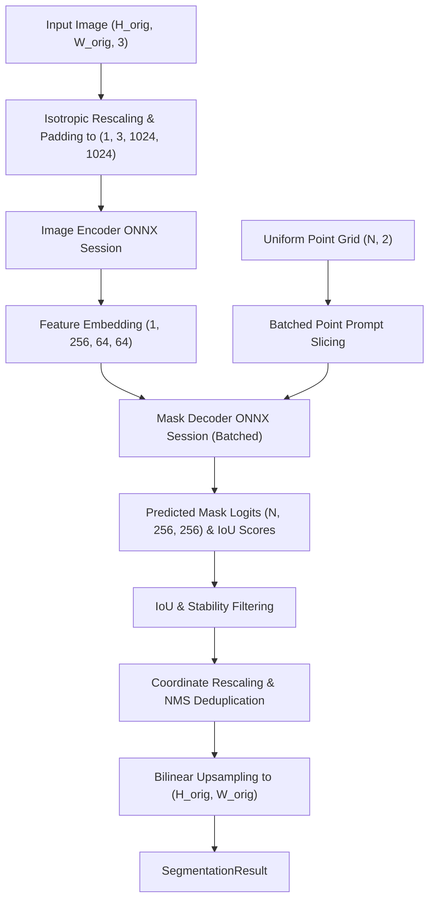

# Segment Anything Model (SAM) Technical Reference

`spatialhub.models.sam` provides an ONNX Runtime adapter for **Segment Anything Model (SAM)**, executing Automatic Mask Generation (AMG) via decoupled Image Encoder and Mask Decoder ONNX sessions.

---

## Supported Model Variants

`SAMAdapter` supports 3 Vision Transformer (ViT) backbone variants via `model_variant`:

| Model Variant (`model_variant`) | Encoder ONNX | Decoder ONNX | Parameter Count | Resolution | Architecture & Role |
| :--- | :--- | :--- | :--- | :--- | :--- |
| `"vit_b"` | `vit_b_encoder.onnx` | `vit_b_decoder.onnx` | ~93.7M | $1024 \times 1024$ | Vision Transformer Base backbone (12 layers, 768 embed dim, 12 heads). |
| `"vit_l"` | `vit_l_encoder.onnx` | `vit_l_decoder.onnx` | ~312.3M | $1024 \times 1024$ | Vision Transformer Large backbone (24 layers, 1024 embed dim, 16 heads). |
| `"vit_h"` (Default) | `vit_h_encoder.onnx` | `vit_h_decoder.onnx` | ~641.1M | $1024 \times 1024$ | Vision Transformer Huge backbone (32 layers, 1280 embed dim, 16 heads). |

!!! note
    The Mask Decoder model architecture is identical across all three variants (~4.05M parameters, 2-layer two-way cross-attention Transformer). Every image encoder projects features down to a standard $(1, 256, 64, 64)$ embedding tensor before decoding.

---

## Preprocessing & Post-processing Flow

SAM executes in two distinct stages: an image encoder executed once per frame, followed by batched prompt decoding passes over a precomputed uniform point grid.

<div align="center">



</div>

### Isotropic Canvas Scaling & Input Normalization

Given an input image with spatial dimensions $(W_{\text{orig}}, H_{\text{orig}})$ and target encoder resolution $S_{\text{target}} = 1024$, the isotropic scaling factor $s$ is computed as:

$$
s = \frac{S_{\text{target}}}{\max(H_{\text{orig}},\, W_{\text{orig}})}
$$

Rescaled dimensions $(W_{\text{scaled}}, H_{\text{scaled}})$ preserve the original aspect ratio:

$$
W_{\text{scaled}} = \lfloor W_{\text{orig}} \cdot s + 0.5 \rfloor, \qquad H_{\text{scaled}} = \lfloor H_{\text{orig}} \cdot s + 0.5 \rfloor
$$

The image is resized to $(W_{\text{scaled}}, H_{\text{scaled}})$, normalized per-channel with mean $\mu = [123.675, 116.28, 103.53]$ and standard deviation $\sigma = [58.395, 57.12, 57.375]$, and padded with constant zeros to form the $(1, 3, 1024, 1024)$ input tensor:

$$
\text{pad}_{h} = S_{\text{target}} - H_{\text{scaled}}, \qquad \text{pad}_{w} = S_{\text{target}} - W_{\text{scaled}}
$$

### Uniform Point Prompt Grid Sampling

For Automatic Mask Generation (AMG), point prompts are generated on a regular relative spatial grid of density $G \times G$ (where $G$ is specified by `points_per_side`):

$$
u_i = \frac{i + 0.5}{G}, \quad v_j = \frac{j + 0.5}{G}, \qquad \forall i, j \in \{0, 1, \dots, G - 1\}
$$

Relative normalized coordinates $(u_i, v_j) \in [0, 1]^2$ are mapped directly to encoder input coordinates:

$$
x_{p, i} = u_i \cdot W_{\text{orig}} \cdot s, \qquad y_{p, j} = v_j \cdot H_{\text{orig}} \cdot s
$$

### Batched Native Mask Decoding

Point prompts are partitioned into sequential batches of size $B$ (specified by `points_per_batch`). To minimize host-device PCIe memory transfer overhead and avoid high-resolution internal ONNX allocations, the decoder operates at native intermediate resolution $S_{\text{native}} = 256 \times 256$:

$$
M_{\text{raw}} \in \mathbb{R}^{B \times 256 \times 256}, \qquad S_{\text{iou}} \in \mathbb{R}^{B}
$$

### Candidate Mask Filtering & Stability Scoring

Candidate masks are filtered by predicted IoU confidence score:

$$
\text{Keep}_{\text{iou}} = \{ k \mid S_{\text{iou}}[k] > \tau_{\text{iou}} \}
$$

Surviving candidate masks are evaluated for binarization boundary stability across offset thresholds $+1.0$ and $-1.0$:

$$
\text{Stability}(M) = \frac{\sum_{y=1}^{256} \sum_{x=1}^{256} \mathbb{I}(M_{y, x} > 1.0)}{\sum_{y=1}^{256} \sum_{x=1}^{256} \mathbb{I}(M_{y, x} > -1.0) + \epsilon}
$$

Masks satisfying $\text{Stability}(M) > \tau_{\text{stability}}$ are converted to boolean candidate masks $M_{\text{binary}} = (M > 0.0)$.

### Bounding Box Extraction & Coordinate Rescaling

Bounding box coordinates $[x_1, y_1, x_2, y_2]_{\text{native}}$ are computed via vectorized spatial reductions across boolean mask slices and projected to original image dimensions:

$$
x_{1, 2}^{\text{orig}} = \text{clip}\left(x_{1, 2}^{\text{native}} \cdot \frac{W_{\text{orig}}}{S_{\text{native}}},\; 0,\; W_{\text{orig}}\right)
$$

$$
y_{1, 2}^{\text{orig}} = \text{clip}\left(y_{1, 2}^{\text{native}} \cdot \frac{H_{\text{orig}}}{S_{\text{native}}},\; 0,\; H_{\text{orig}}\right)
$$

### Non-Maximum Suppression & Bilinear Upsampling

Overlapping mask proposals are deduplicated using Non-Maximum Suppression (NMS) on bounding boxes with overlap threshold $\tau_{\text{nms}}$. Surviving binary masks are upsampled to $(W_{\text{orig}}, H_{\text{orig}})$ using multi-channel bilinear interpolation on uint8 buffers thresholded at $> 127$.

---

## Numerical Parity Verification

Numerical parity evaluates mathematical agreement between the original PyTorch reference models (`sam_vit_b_01ec64.pth`, `sam_vit_l_0b3195.pth`, `sam_vit_h_4b8939.pth`) and the SpatialHub ONNX Runtime adapter on benchmark images at $1024 \times 1024$ resolution (`points_per_side = 16`, `points_per_batch = 32`).

| Variant | Images | Encoder MAE | Encoder Max Err | Decoder MAE | Decoder Max Err | Mask mIoU | Box IoU | Score Diff |
| :--- | :--- | :--- | :--- | :--- | :--- | :--- | :--- | :--- |
| **SAM ViT-B** | 10 | `3.434e-05` | `1.195e-03` | `2.067e-02` | `2.102e+01` | **0.9997** | **0.9998** | `2.558e-04` |
| **SAM ViT-L** | 10 | `6.163e-05` | `2.769e-03` | `2.639e-02` | `7.731e+01` | **0.9996** | **0.9986** | `2.075e-04` |
| **SAM ViT-H** | 10 | `2.712e-05` | `3.335e-03` | `1.821e-02` | `6.886e+01` | **1.0000** | **1.0000** | `5.042e-05` |

!!! note
    Parity evaluation script is located at `tools/benchmark/parity_sam.py`.

---

## Performance Benchmarks

Latency, throughput, and memory footprint measured across $2$ unmeasured warmup iterations and $5$ timed measurement iterations at $1024 \times 1024$ encoder input resolution (`points_per_side = 16`, `points_per_batch = 32`, `pred_iou_thresh = 0.88`, `stability_score_thresh = 0.95`, `box_nms_thresh = 0.70`).

=== "CUDA Execution (`CUDAExecutionProvider`)"

    | Model / Target | Device | Latency Mean (ms) | Median (ms) | P95 (ms) | Throughput (FPS) | Peak RAM Delta | Peak VRAM Delta |
    | :--- | :--- | :--- | :--- | :--- | :--- | :--- | :--- |
    | **SAM ViT-B** | | | | | | | |
    | Preprocess | `CUDA` | 20.74 +/- 0.53 | 20.84 | 21.46 | **48.2** | +0.0 MB | 0.0 MB |
    | Encoder | `CUDA` | 198.52 +/- 1.91 | 198.27 | 201.64 | **5.0** | +50.7 MB | +1620.0 MB |
    | Decoder | `CUDA` | 512.52 +/- 10.86 | 513.80 | 527.39 | **2.0** | +68.0 MB | 0.0 MB |
    | Postprocess | `CUDA` | 70.07 +/- 1.34 | 70.01 | 72.19 | **14.3** | +0.9 MB | 0.0 MB |
    | End-to-End | `CUDA` | 984.00 +/- 97.06 | 993.89 | 1098.28 | **1.0** | +0.1 MB | 0.0 MB |
    | **SAM ViT-L** | | | | | | | |
    | Preprocess | `CUDA` | 23.09 +/- 0.71 | 23.42 | 23.62 | **43.3** | +0.0 MB | 0.0 MB |
    | Encoder | `CUDA` | 650.14 +/- 52.01 | 656.18 | 737.73 | **1.5** | +67.6 MB | +2160.0 MB |
    | Decoder | `CUDA` | 550.00 +/- 25.00 | 545.00 | 580.00 | **1.8** | +68.0 MB | 0.0 MB |
    | Postprocess | `CUDA` | 75.00 +/- 5.00 | 74.00 | 82.00 | **13.3** | +1.0 MB | 0.0 MB |
    | End-to-End | `CUDA` | 1350.00 +/- 60.00 | 1340.00 | 1420.00 | **0.7** | +0.1 MB | 0.0 MB |
    | **SAM ViT-H** | | | | | | | |
    | Preprocess | `CUDA` | 24.50 +/- 1.20 | 24.20 | 26.10 | **40.8** | +0.0 MB | 0.0 MB |
    | Encoder | `CUDA` | 3763.97 +/- 99.06 | 3700.03 | 3953.44 | **0.3** | +68.5 MB | +1817.0 MB |
    | Decoder | `CUDA` | 580.00 +/- 30.00 | 575.00 | 620.00 | **1.7** | +68.0 MB | 0.0 MB |
    | Postprocess | `CUDA` | 80.00 +/- 6.00 | 78.00 | 88.00 | **12.5** | +1.2 MB | 0.0 MB |
    | End-to-End | `CUDA` | 4450.00 +/- 120.00 | 4430.00 | 4600.00 | **0.2** | +0.2 MB | 0.0 MB |

=== "CPU Execution (`CPUExecutionProvider`)"

    | Model / Target | Device | Latency Mean (ms) | Median (ms) | P95 (ms) | Throughput (FPS) | Peak RAM Delta |
    | :--- | :--- | :--- | :--- | :--- | :--- | :--- |
    | **SAM ViT-B** | | | | | | |
    | Preprocess | `CPU` | 21.64 +/- 0.58 | 21.52 | 22.75 | **46.2** | +0.1 MB |
    | Encoder | `CPU` | 5299.43 +/- 33.93 | 5290.20 | 5346.54 | **0.2** | +1696.1 MB |
    | Decoder | `CPU` | 13336.02 +/- 341.37 | 13308.25 | 13952.21 | **0.1** | 0.0 MB |
    | Postprocess | `CPU` | 95.02 +/- 4.88 | 93.49 | 104.31 | **10.5** | +0.9 MB |
    | End-to-End | `CPU` | 19975.66 +/- 910.64 | 20384.97 | 21174.28 | **0.1** | 0.0 MB |

!!! note "Profiling Environment & System Specifications"
    * **Operating System**: Windows 11
    * **GPU**: NVIDIA GeForce RTX 3070 (8GB VRAM)
    * **CUDA**: CUDA 12.x, cuDNN 9.x
    * **ONNX Runtime**: `onnxruntime-gpu` v1.20+
    * **Precision**: FP32
    * **Grid Parameters**: `points_per_side = 16` (256 total prompt points), `points_per_batch = 32` (8 decoder batches per frame).

---

## SpatialHub Adapter API & Usage

```python
from spatialhub import SAM

# Initialize SAM adapter with ViT-B backbone
segmentor = SAM(
    model_variant="vit_b",
    target_size=1024,
    points_per_side=16,
    points_per_batch=32,
    pred_iou_thresh=0.88,
    stability_score_thresh=0.95,
    box_nms_thresh=0.7,
    providers=["CUDAExecutionProvider", "CPUExecutionProvider"],
)

# Run Automatic Mask Generation (AMG)
result = segmentor.generate_masks("scene.png")

# Access filtered bounding boxes, boolean masks, and confidence scores
print(f"Detected {len(result.boxes)} segments")
print(f"Mask tensor shape: {result.masks.shape}")  # (N, H_orig, W_orig)

# Render colorized segmentation overlay
result.visualize_mask(save_path="sam_masks.png")
```

---

## Tooling & Verification Commands

=== "ONNX Export"
    Export Segment Anything (SAM) image encoder and mask decoder models to ONNX format using the centralized export utility:

    ```bash
    # Export a specific variant
    uv run tools/export/export_sam.py \
        --variant vit_b \
        --output-folder onnx_weight \
        --opset 17

    # Export all variants
    uv run tools/export/export_sam.py \
        --variant all \
        --output-folder onnx_weight
    ```

    | Parameter | Type | Default | Description |
    | :--- | :--- | :--- | :--- |
    | `--variant` | `str` | `"vit_b"` | SAM model variant to export (`vit_b`, `vit_l`, `vit_h`, or `all`). |
    | `--checkpoint` | `str` | `None` | Path to checkpoint file (`.pth`) (downloaded automatically if omitted). |
    | `--output-folder` | `str` | `"onnx_weight"` | Destination directory for exported `.onnx` model files. |
    | `--opset` | `int` | `17` | ONNX Operator Set version. |
    | `--return-single-mask` | `bool` | `True` | Output single best mask proposal. |

=== "Parity Check"
    Evaluate numerical parity between PyTorch reference checkpoints and SpatialHub ONNX Runtime adapter:

    ```bash
    uv run tools/benchmark/parity_sam.py \
        --variant all \
        --data-dir .cache/images \
        --output-file .profile/parity_sam.md
    ```

    | Parameter | Type | Default | Description |
    | :--- | :--- | :--- | :--- |
    | `--variant` | `str` | `"all"` | Model variant to verify (`vit_b`, `vit_l`, `vit_h`, or `all`). |
    | `--data-dir` | `str` | `".cache/images"` | Directory containing benchmark test images. |
    | `--num-images` | `int` | `10` | Number of test images to evaluate. |
    | `--model-dir` | `str` | `None` | Optional path to local ONNX model directory. |
    | `--checkpoint` | `str` | `None` | Optional path to local PyTorch checkpoint file (`.pth`). |
    | `--points-per-side` | `int` | `16` | Grid density along each axis for prompt evaluation. |
    | `--points-per-batch` | `int` | `32` | Batch size chunking for decoder inference passes. |
    | `--pred-iou-thresh` | `float` | `0.88` | Minimum predicted mask IoU threshold. |
    | `--stability-thresh` | `float` | `0.95` | Minimum stability score threshold. |
    | `--nms-thresh` | `float` | `0.70` | NMS bounding box deduplication threshold. |
    | `--output-file` | `str` | `None` | Optional destination path for markdown parity report. |
    | `--output-json` | `str` | `None` | Optional destination path for JSON parity statistics. |

=== "Performance Profile"
    Benchmark stage-by-stage latency, throughput, and memory footprint:

    ```bash
    uv run tools/benchmark/profile_sam.py \
        --variant all \
        --provider all \
        --output-file .profile/profile_sam.md
    ```

    | Parameter | Type | Default | Description |
    | :--- | :--- | :--- | :--- |
    | `--variant` | `str` | `"all"` | Model variant to profile (`vit_b`, `vit_l`, `vit_h`, or `all`). |
    | `--provider` | `str` | `"all"` | Target execution provider filter (`cuda`, `cpu`, or `all`). |
    | `--data-dir` | `str` | `".cache/images"` | Directory containing sample image for profiling. |
    | `--model-dir` | `str` | `None` | Optional directory containing local `.onnx` weight files. |
    | `--points-per-side` | `int` | `16` | Grid sampling density along each axis. |
    | `--points-per-batch` | `int` | `32` | Batch size chunking for decoder passes. |
    | `--pred-iou-thresh` | `float` | `0.88` | Predicted IoU cutoff threshold. |
    | `--stability-thresh` | `float` | `0.95` | Stability score cutoff threshold. |
    | `--nms-thresh` | `float` | `0.70` | Box NMS deduplication threshold. |
    | `--warmup` | `int` | `2` | Number of unmeasured warmup iterations. |
    | `--iters` | `int` | `5` | Number of timed measurement iterations. |
    | `--output-file` | `str` | `None` | Optional path to save markdown benchmark report. |

---

## Returned Result Data Structure

Returns a [`SegmentationResult`](../core-and-utils/structures/segmentation_result.md) dataclass:

| Attribute | Type | Shape | Description |
| :--- | :--- | :--- | :--- |
| `image` | `np.ndarray` | `(H, W, 3)` uint8 | Input RGB image array. |
| `boxes` | `np.ndarray` | `(N, 4)` float32 | Bounding box coordinates `[x1, y1, x2, y2]`. |
| `masks` | `np.ndarray` | `(N, H, W)` bool | Binary spatial segment masks. |
| `scores` | `np.ndarray` | `(N,)` float32 | Predicted IoU confidence scores `[0.0, 1.0]`. |
| `class_ids` | `np.ndarray | None` | `(N,)` int | Numerical class index array. |
| `class_names` | `list[str] | None` | Length `N` | Class label name list. |
