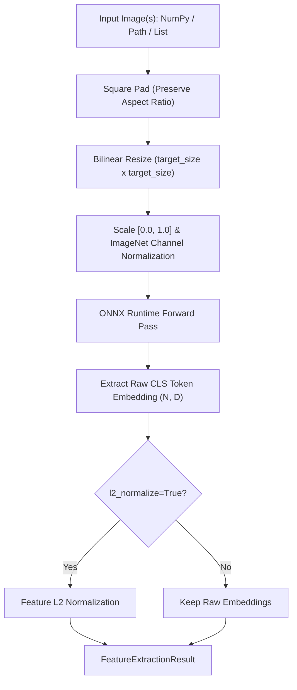

# DINOv2 Technical Reference

`spatialhub.models.dinov2` provides an ONNX Runtime adapter for **DINOv2**, extracting global L2-normalized CLS token feature embeddings from images.

---

## Supported Model Variants

The `DINOv2Adapter` supports 4 Vision Transformer backbone variants via `model_variant`:

| Model Variant (`model_variant`) | ONNX File | Parameter Count | Embedding Dimension ($D$) | Architecture & Role |
| :--- | :--- | :--- | :--- | :--- |
| `"vits14"` | `dinov2_vits14.onnx` | ~21M | $D = 384$ | ViT-Small/14 backbone (high throughput, minimal memory footprint). |
| `"vitb14"` | `dinov2_vitb14.onnx` | ~86M | $D = 768$ | ViT-Base/14 backbone (balanced descriptor capacity). |
| `"vitl14"` (Default) | `dinov2_vitl14.onnx` | ~300M | $D = 1024$ | ViT-Large/14 backbone (high semantic representation capacity). |
| `"vitg14"` | `dinov2_vitg14.onnx` | ~1.1B | $D = 1536$ | ViT-Giant/14 backbone (maximum representation capacity). |

---

## Preprocessing & Post-processing Flow

DINOv2 extracts global feature embeddings from input images through square padding, bilinear resizing, and ImageNet channel normalization.



### Square Padding & Spatial Resizing

Given an input image with native dimensions $(W, H)$, the image is zero-padded along the shorter dimension to form a square canvas of side $S = \max(W, H)$, preserving aspect ratio:

$$
x_{\text{offset}} = \left\lfloor \frac{S - W}{2} \right\rfloor, \qquad y_{\text{offset}} = \left\lfloor \frac{S - H}{2} \right\rfloor
$$

The square canvas is resized to spatial dimension $S_{\text{target}} \times S_{\text{target}}$ (`target_size`, default $224 \times 224$), which must be a positive integer multiple of the ViT patch size ($14\text{ px}$):

$$
S_{\text{target}} = 14 \cdot k, \quad k \in \mathbb{Z}^+
$$

### ImageNet Normalization

Pixel values scaled to $[0.0, 1.0]$ are normalized per channel $c \in \{R, G, B\}$:

$$
x_{\text{norm}} = \frac{x - \mu_c}{\sigma_c}
$$

Where $\mu = [0.485, 0.456, 0.406]$ and $\sigma = [0.229, 0.224, 0.225]$.

### L2 Feature Normalization

When `l2_normalize=True`, extracted CLS token embedding vectors $v \in \mathbb{R}^D$ are normalized to unit Euclidean length:

$$
v_{\text{norm}} = \frac{v}{\max(\|v\|_2,\, 10^{-6})} = \frac{v}{\max\left(\sqrt{\sum_{i=1}^D v_i^2},\, 10^{-6}\right)}
$$

---

## Numerical Parity Verification

Numerical parity evaluates mathematical agreement between the original PyTorch Hub reference models (`facebookresearch/dinov2`) and the SpatialHub ONNX Runtime adapter on $20$ benchmark images sampled from the [COCO 2017 validation dataset](http://images.cocodataset.org/zips/val2017.zip) (`val2017.zip` extracted to `.cache/images/`) at $224 \times 224$ resolution.

| Model Variant | Cosine Sim | Feature L2 Dist | Feature MAE | Max Diff | Rel Error (%) |
| :--- | :--- | :--- | :--- | :--- | :--- |
| `vits14` | 0.999999 | 0.001066 | $4.32 \times 10^{-5}$ | $3.20 \times 10^{-4}$ | **0.11%** |
| `vitb14` | 1.000000 | 0.000874 | $2.50 \times 10^{-5}$ | $1.38 \times 10^{-4}$ | **0.09%** |
| `vitl14` | 1.000000 | 0.000816 | $2.02 \times 10^{-5}$ | $1.96 \times 10^{-4}$ | **0.08%** |
| `vitg14` | 1.000000 | 0.000305 | $6.19 \times 10^{-6}$ | $3.90 \times 10^{-5}$ | **0.03%** |

To evaluate parity on local sample images:

```bash
uv run tools/benchmark/parity_dinov2.py \
    --variant all \
    --data-dir .cache/images \
    --output-file .profile/parity_dinov2.md
```

---

## Performance Benchmarks

Latency, throughput, and memory footprint measured across $10$ unmeasured warmup iterations and $50$ timed measurement iterations at $224 \times 224$ resolution.

### CUDA Execution (`CUDAExecutionProvider`)

<table>
  <thead>
    <tr>
      <th>Variant</th>
      <th>Stage</th>
      <th>Latency Mean (ms)</th>
      <th>Median (ms)</th>
      <th>P95 (ms)</th>
      <th>Throughput (FPS)</th>
      <th>Peak RAM Delta</th>
      <th>Peak VRAM Delta</th>
    </tr>
  </thead>
  <tbody>
    <tr>
      <td rowspan="3" style="vertical-align: middle; text-align: center; font-weight: bold; border-right: 2px solid #ddd;"><code>vits14</code></td>
      <td>Preprocess</td>
      <td>1.07 +/- 0.13</td>
      <td>1.08</td>
      <td>1.29</td>
      <td>931.7</td>
      <td>+0.6 MB</td>
      <td>0.0 MB</td>
    </tr>
    <tr>
      <td>Inference</td>
      <td>4.73 +/- 0.58</td>
      <td>4.61</td>
      <td>5.64</td>
      <td><strong>211.4</strong></td>
      <td>+0.2 MB</td>
      <td>+6.0 MB</td>
    </tr>
    <tr style="border-bottom: 2px solid #ccc;">
      <td>End-to-End</td>
      <td>5.44 +/- 0.66</td>
      <td>5.38</td>
      <td>6.37</td>
      <td><strong>183.7</strong></td>
      <td>+2.9 MB</td>
      <td>0.0 MB</td>
    </tr>
    <tr>
      <td rowspan="3" style="vertical-align: middle; text-align: center; font-weight: bold; border-right: 2px solid #ddd;"><code>vitb14</code></td>
      <td>Preprocess</td>
      <td>1.28 +/- 0.16</td>
      <td>1.22</td>
      <td>1.56</td>
      <td>784.3</td>
      <td>+1.1 MB</td>
      <td>0.0 MB</td>
    </tr>
    <tr>
      <td>Inference</td>
      <td>8.50 +/- 0.59</td>
      <td>8.28</td>
      <td>9.66</td>
      <td><strong>117.7</strong></td>
      <td>0.0 MB</td>
      <td>+10.0 MB</td>
    </tr>
    <tr style="border-bottom: 2px solid #ccc;">
      <td>End-to-End</td>
      <td>9.20 +/- 0.51</td>
      <td>9.05</td>
      <td>10.35</td>
      <td><strong>108.7</strong></td>
      <td>+1.1 MB</td>
      <td>0.0 MB</td>
    </tr>
    <tr>
      <td rowspan="3" style="vertical-align: middle; text-align: center; font-weight: bold; border-right: 2px solid #ddd;"><code>vitl14</code></td>
      <td>Preprocess</td>
      <td>1.24 +/- 0.15</td>
      <td>1.20</td>
      <td>1.63</td>
      <td>806.4</td>
      <td>+1.1 MB</td>
      <td>0.0 MB</td>
    </tr>
    <tr>
      <td>Inference</td>
      <td>29.00 +/- 2.60</td>
      <td>29.76</td>
      <td>31.70</td>
      <td><strong>34.5</strong></td>
      <td>0.0 MB</td>
      <td>+14.0 MB</td>
    </tr>
    <tr style="border-bottom: 2px solid #ccc;">
      <td>End-to-End</td>
      <td>32.71 +/- 0.98</td>
      <td>32.24</td>
      <td>34.47</td>
      <td><strong>30.6</strong></td>
      <td>+1.0 MB</td>
      <td>0.0 MB</td>
    </tr>
    <tr>
      <td rowspan="3" style="vertical-align: middle; text-align: center; font-weight: bold; border-right: 2px solid #ddd;"><code>vitg14</code></td>
      <td>Preprocess</td>
      <td>1.17 +/- 0.11</td>
      <td>1.13</td>
      <td>1.42</td>
      <td>854.4</td>
      <td>+1.1 MB</td>
      <td>0.0 MB</td>
    </tr>
    <tr>
      <td>Inference</td>
      <td>133.93 +/- 16.64</td>
      <td>121.71</td>
      <td>156.30</td>
      <td><strong>7.5</strong></td>
      <td>+0.6 MB</td>
      <td>+20.0 MB</td>
    </tr>
    <tr>
      <td>End-to-End</td>
      <td>192.66 +/- 37.56</td>
      <td>188.61</td>
      <td>277.27</td>
      <td><strong>5.2</strong></td>
      <td>+2.7 MB</td>
      <td>0.0 MB</td>
    </tr>
  </tbody>
</table>

> [!NOTE]
> **Hardware Power & Thermal Scaling on `vitg14`**:
> On `vitg14` (~1.1B parameters), isolated inference reflects peak GPU boost clocks (~1575 MHz at 140W TGP, ~133.9 ms). Under continuous sequential load across benchmark stages, GPU thermal management and power limits throttle operating clocks to steady-state frequencies (~1110–1200 MHz at ~89W, ~192.7 ms).

### CPU Execution (`CPUExecutionProvider`)

<table>
  <thead>
    <tr>
      <th>Variant</th>
      <th>Stage</th>
      <th>Latency Mean (ms)</th>
      <th>Median (ms)</th>
      <th>P95 (ms)</th>
      <th>Throughput (FPS)</th>
      <th>Peak RAM Delta</th>
    </tr>
  </thead>
  <tbody>
    <tr>
      <td rowspan="3" style="vertical-align: middle; text-align: center; font-weight: bold; border-right: 2px solid #ddd;"><code>vits14</code></td>
      <td>Preprocess</td>
      <td>1.26 +/- 0.14</td>
      <td>1.24</td>
      <td>1.54</td>
      <td>794.6</td>
      <td>+1.7 MB</td>
    </tr>
    <tr>
      <td>Inference</td>
      <td>43.96 +/- 4.27</td>
      <td>42.78</td>
      <td>52.61</td>
      <td><strong>22.7</strong></td>
      <td>+1.1 MB</td>
    </tr>
    <tr style="border-bottom: 2px solid #ccc;">
      <td>End-to-End</td>
      <td>44.94 +/- 1.97</td>
      <td>44.79</td>
      <td>47.99</td>
      <td><strong>22.3</strong></td>
      <td>0.0 MB</td>
    </tr>
    <tr>
      <td rowspan="3" style="vertical-align: middle; text-align: center; font-weight: bold; border-right: 2px solid #ddd;"><code>vitb14</code></td>
      <td>Preprocess</td>
      <td>1.38 +/- 0.17</td>
      <td>1.36</td>
      <td>1.74</td>
      <td>722.2</td>
      <td>0.0 MB</td>
    </tr>
    <tr>
      <td>Inference</td>
      <td>141.89 +/- 6.92</td>
      <td>140.81</td>
      <td>156.49</td>
      <td><strong>7.0</strong></td>
      <td>+0.1 MB</td>
    </tr>
    <tr style="border-bottom: 2px solid #ccc;">
      <td>End-to-End</td>
      <td>144.51 +/- 8.15</td>
      <td>143.84</td>
      <td>153.65</td>
      <td><strong>6.9</strong></td>
      <td>0.0 MB</td>
    </tr>
    <tr>
      <td rowspan="3" style="vertical-align: middle; text-align: center; font-weight: bold; border-right: 2px solid #ddd;"><code>vitl14</code></td>
      <td>Preprocess</td>
      <td>1.26 +/- 0.04</td>
      <td>1.27</td>
      <td>1.34</td>
      <td>791.5</td>
      <td>+1.7 MB</td>
    </tr>
    <tr>
      <td>Inference</td>
      <td>512.34 +/- 9.32</td>
      <td>512.58</td>
      <td>530.10</td>
      <td><strong>2.0</strong></td>
      <td>0.0 MB</td>
    </tr>
    <tr style="border-bottom: 2px solid #ccc;">
      <td>End-to-End</td>
      <td>521.78 +/- 15.71</td>
      <td>520.54</td>
      <td>542.00</td>
      <td><strong>1.9</strong></td>
      <td>0.0 MB</td>
    </tr>
    <tr>
      <td rowspan="3" style="vertical-align: middle; text-align: center; font-weight: bold; border-right: 2px solid #ddd;"><code>vitg14</code></td>
      <td>Preprocess</td>
      <td>1.48 +/- 0.11</td>
      <td>1.46</td>
      <td>1.69</td>
      <td>674.3</td>
      <td>+1.9 MB</td>
    </tr>
    <tr>
      <td>Inference</td>
      <td>1959.85 +/- 38.62</td>
      <td>1963.05</td>
      <td>2030.01</td>
      <td><strong>0.5</strong></td>
      <td>+3.2 MB</td>
    </tr>
    <tr>
      <td>End-to-End</td>
      <td>1916.91 +/- 26.12</td>
      <td>1912.71</td>
      <td>1967.96</td>
      <td><strong>0.5</strong></td>
      <td>0.0 MB</td>
    </tr>
  </tbody>
</table>

---

## SpatialHub Adapter API & Usage

```python
from spatialhub.models.dinov2 import DINOv2Adapter

# Initialize DINOv2 adapter with ViT-L/14 backbone (1024-dim)
with DINOv2Adapter(
    model_variant="vitl14",
    target_size=224,
    providers=["CUDAExecutionProvider", "CPUExecutionProvider"],
) as extractor:
    # Single image input (path or array)
    result_single = extractor.extract_features("sample.jpg", l2_normalize=True)
    print("Single embedding shape:", result_single.features.shape)  # (1, 1024)

    # Batch or collection input (list of images or paths)
    result_batch = extractor.extract_features(["image_0.jpg", "image_1.jpg"], l2_normalize=True)
    print("Batch embedding shape:", result_batch.features.shape)   # (2, 1024)
```

---

## Tooling & Verification Commands

### ONNX Export

Export DINOv2 backbone models from PyTorch Hub to ONNX format:

```bash
# Export a specific variant
uv run tools/export/export_dinov2.py \
    --variant vitl14 \
    --output-folder onnx_weight \
    --opset 17

# Export all variants
uv run tools/export/export_dinov2.py \
    --variant all \
    --output-folder onnx_weight
```

| Parameter | Type | Default | Description |
| :--- | :--- | :--- | :--- |
| `--variant` | `str` | `"vitl14"` | Model variant to export (`vits14`, `vitb14`, `vitl14`, `vitg14`, or `all`). |
| `--output-folder` | `str` | `"onnx_weight"` | Destination directory for exported `.onnx` models. |
| `--width` | `int` | `224` | Input image width in pixels (must be a multiple of 14). |
| `--height` | `int` | `224` | Input image height in pixels (must be a multiple of 14). |
| `--image-size` | `int` | `None` | Convenience parameter to set square dimensions (`width = height = image_size`). |
| `--opset` | `int` | `17` | ONNX Operator Set version. |

### Parity Check

Evaluate numerical parity between PyTorch Hub reference models and SpatialHub ONNX Runtime adapter:

```bash
uv run tools/benchmark/parity_dinov2.py \
    --variant all \
    --data-dir .cache/images \
    --output-file .profile/parity_dinov2.md
```

| Parameter | Type | Default | Description |
| :--- | :--- | :--- | :--- |
| `--variant` | `str` | `"all"` | Model variant to evaluate (`vits14`, `vitb14`, `vitl14`, `vitg14`, or `all`). |
| `--data-dir` | `str` | `".cache/images"` | Directory containing benchmark image files. |
| `--model-dir` | `str` | `None` | Optional directory containing local `.onnx` weight files. |
| `--max-images` | `int` | `20` | Maximum number of images to evaluate. |
| `--output-file` | `str` | `None` | Optional path to output markdown report file. |

### Performance Profile

Benchmark stage-by-stage latency, throughput, and memory footprint:

```bash
uv run tools/benchmark/profile_dinov2.py \
    --variant all \
    --provider all \
    --data-dir .cache/images \
    --warmup 10 \
    --iters 50 \
    --output-file .profile/profile_dinov2.md
```

| Parameter | Type | Default | Description |
| :--- | :--- | :--- | :--- |
| `--variant` | `str` | `"all"` | Model variant to profile (`vits14`, `vitb14`, `vitl14`, `vitg14`, or `all`). |
| `--provider` | `str` | `"all"` | Target execution provider filter (`cuda`, `cpu`, or `all`). |
| `--data-dir` | `str` | `".cache/images"` | Directory containing sample image for profiling. |
| `--model-dir` | `str` | `None` | Optional directory containing local `.onnx` weight files. |
| `--warmup` | `int` | `10` | Number of unmeasured warmup iterations. |
| `--iters` | `int` | `50` | Number of timed measurement iterations. |
| `--output-file` | `str` | `None` | Optional path to save markdown benchmark report. |

---

## Returned Result Data Structure

Returns a [`FeatureExtractionResult`](https://spatialhub-ai.github.io/spatialhub/core-and-utils/structures/feature_extraction_result/) dataclass:

| Attribute | Type | Shape | Description |
| :--- | :--- | :--- | :--- |
| `images` | `np.ndarray` | `(H, W, 3)` or `(N, H, W, 3)` | Original input image array or stacked batch array. |
| `features` | `np.ndarray` | `(N, D)` float32 | Extracted global CLS token feature embedding vectors. |
| `embedding_type` | `str` | N/A | Feature scope (`"global"`). |
| `l2_normalized` | `bool` | N/A | Flag indicating whether feature embeddings are unit L2-normalized. |
