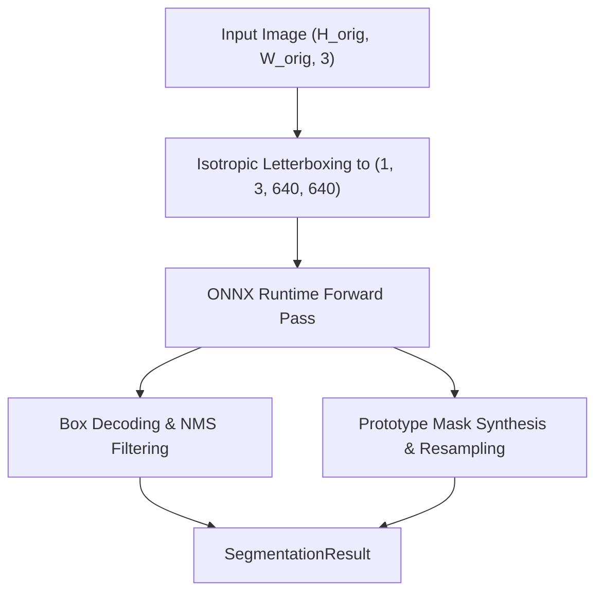

# FastSAM Technical Reference

`spatialhub.models.fastsam` provides an ONNX Runtime adapter for **FastSAM (YOLOv8-Seg)**, performing real-time instance segmentation and mask proposal generation.

---

## Supported Model Variants

`FastSAMAdapter` supports 2 YOLOv8-Seg model variants via `model_variant`:

| Model Variant (`model_variant`) | ONNX File | Parameter Count | Resolution | Architecture & Role |
| :--- | :--- | :--- | :--- | :--- |
| `"s"` | `FastSAM-s.onnx` | ~11.1M | $640 \times 640$ | Small YOLOv8-Seg backbone variant (high throughput, minimal memory footprint). |
| `"x"` (Default) | `FastSAM-x.onnx` | ~68.2M | $640 \times 640$ | Extra Large YOLOv8-Seg backbone variant (high semantic representation capacity). |

---

## Preprocessing & Post-processing Flow

FastSAM decodes bounding boxes, confidence scores, and prototype mask coefficients from a YOLOv8-Seg ONNX graph output of shape $(1, 37, 8400)$ and prototype tensor of shape $(1, 32, 160, 160)$.



### Isotropic Letterboxing & Canvas Mapping

Given input image dimensions $(W_{\text{orig}}, H_{\text{orig}})$ and network dimension $S_{\text{img}} = 640$:

$$
(W_{\text{scaled}},\, H_{\text{scaled}}) = \left(\lfloor W_{\text{orig}} \cdot s \rfloor,\; \lfloor H_{\text{orig}} \cdot s \rfloor\right), \qquad s = \min\left(\frac{S_{\text{img}}}{H_{\text{orig}}},\; \frac{S_{\text{img}}}{W_{\text{orig}}}\right)
$$

Symmetric padding margins form the square canvas of side $S_{\text{img}} \times S_{\text{img}}$:

$$
\begin{pmatrix} \text{pad}_{\text{top}} \\[6pt] \text{pad}_{\text{left}} \end{pmatrix} = \begin{pmatrix} \left\lfloor \frac{S_{\text{img}} - H_{\text{scaled}}}{2} \right\rfloor \\[6pt] \left\lfloor \frac{S_{\text{img}} - W_{\text{scaled}}}{2} \right\rfloor \end{pmatrix}, \qquad \begin{pmatrix} \text{pad}_{\text{bottom}} \\[6pt] \text{pad}_{\text{right}} \end{pmatrix} = \begin{pmatrix} S_{\text{img}} - H_{\text{scaled}} - \text{pad}_{\text{top}} \\[6pt] S_{\text{img}} - W_{\text{scaled}} - \text{pad}_{\text{left}} \end{pmatrix}
$$

### Bounding Box Decoding & Projection

For each anchor with center-format predictions $(cx, cy, w, h)$, corner coordinates are clamped to canvas boundaries $[0, S_{\text{img}}]$:

$$
\begin{pmatrix} x_1 \\[4pt] y_1 \\[4pt] x_2 \\[4pt] y_2 \end{pmatrix} = \begin{pmatrix} \text{clip}\left(cx - \frac{w}{2},\; 0,\; S_{\text{img}}\right) \\[4pt] \text{clip}\left(cy - \frac{h}{2},\; 0,\; S_{\text{img}}\right) \\[4pt] \text{clip}\left(cx + \frac{w}{2},\; 0,\; S_{\text{img}}\right) \\[4pt] \text{clip}\left(cy + \frac{h}{2},\; 0,\; S_{\text{img}}\right) \end{pmatrix}
$$

Candidate boxes passing confidence threshold $s > \tau_{\text{conf}}$ and NMS IoU threshold $\tau_{\text{iou}}$ are projected back to native image dimensions:

$$
B_{\text{orig}} = \begin{pmatrix}
\text{clip}\left(\frac{x_1 - \text{pad}_{\text{left}}}{s},\; 0,\; W_{\text{orig}}\right) \\[6pt]
\text{clip}\left(\frac{y_1 - \text{pad}_{\text{top}}}{s},\; 0,\; H_{\text{orig}}\right) \\[6pt]
\text{clip}\left(\frac{x_2 - \text{pad}_{\text{left}}}{s},\; 0,\; W_{\text{orig}}\right) \\[6pt]
\text{clip}\left(\frac{y_2 - \text{pad}_{\text{top}}}{s},\; 0,\; H_{\text{orig}}\right)
\end{pmatrix}
$$

### Prototype Mask Synthesis & In-Place Boundary Cropping

For mask coefficients $C \in \mathbb{R}^{N \times 32}$ and prototype feature tensor $P \in \mathbb{R}^{32 \times 160 \times 160}$, bounding boxes are scaled to prototype coordinates via stride factor $r = \frac{S_{\text{img}}}{W_{\text{proto}}} = 4.0$:

$$
[x_1, y_1, x_2, y_2]_{\text{proto}} = \frac{1}{r} [x_1, y_1, x_2, y_2]
$$

Mask activations are synthesized and zeroed outside proposal bounding boxes via in-place rectangular slicing:

$$
M_{\text{proto}}[i,\, y,\, x] = \begin{cases}
(C_i \cdot P)_{y, x} & \text{if } x_1 \le x < x_2 \;\land\; y_1 \le y < y_2 \\[6pt]
0 & \text{otherwise}
\end{cases}
$$

### Letterbox Margin Unpadding & Binary Mask Generation

With prototype padding margins:

$$
\begin{pmatrix} p_{\text{top}} \\[6pt] p_{\text{left}} \end{pmatrix} = \begin{pmatrix} \left\lfloor \frac{\text{pad}_{\text{top}}}{r} \right\rfloor \\[6pt] \left\lfloor \frac{\text{pad}_{\text{left}}}{r} \right\rfloor \end{pmatrix}, \qquad \begin{pmatrix} p_{\text{bottom}} \\[6pt] p_{\text{right}} \end{pmatrix} = \begin{pmatrix} \left\lfloor \frac{\text{pad}_{\text{bottom}}}{r} \right\rfloor \\[6pt] \left\lfloor \frac{\text{pad}_{\text{right}}}{r} \right\rfloor \end{pmatrix}
$$

Unpadded prototype masks are sliced and bilinearly upsampled to native image dimensions:

$$
M_{\text{unpadded}} = M_{\text{proto}}[:, \, p_{\text{top}} : H_{\text{proto}} - p_{\text{bottom}}, \, p_{\text{left}} : W_{\text{proto}} - p_{\text{right}}]
$$

$$
M_{\text{binary}} = \begin{cases}
1 & \text{if } \text{BilinearResize}\left(M_{\text{unpadded}},\, (W_{\text{orig}}, H_{\text{orig}})\right) > 0.0 \\[6pt]
0 & \text{otherwise}
\end{cases}
$$

> [!NOTE]
> Because the sigmoid function $\sigma(z) = \frac{1}{1 + e^{-z}}$ is monotonically strictly increasing with $\sigma(0.0) = 0.5$, evaluating $z > 0.0$ on raw logits is mathematically equivalent to $\sigma(z) > 0.5$ while avoiding floating-point transcendental exponentiation.

---

## Numerical Parity Verification

Numerical parity evaluates mathematical agreement between the original PyTorch reference models (`FastSAM-s.pt`, `FastSAM-x.pt`) and the SpatialHub ONNX Runtime adapter on benchmark images at $640 \times 640$ resolution (`conf_threshold = 0.25`, `iou_threshold = 0.70`).

| Variant | Images | Preds MAE | Preds Max Err | Protos MAE | Protos Max Err | Mask mIoU | Box IoU | Score Diff |
| :--- | :--- | :--- | :--- | :--- | :--- | :--- | :--- | :--- |
| **FastSAM-s** | 10 | `5.378e-03` | `2.339e+01` | `1.100e-03` | `6.992e-02` | **0.9997** | **0.9998** | `2.891e-04` |
| **FastSAM-x** | 10 | `5.434e-03` | `1.041e+01` | `9.716e-04` | `1.317e-01` | **0.9999** | **0.9999** | `1.414e-04` |

---

## Performance Benchmarks

Latency, throughput, and memory footprint measured across $10$ unmeasured warmup iterations and $50$ timed measurement iterations at $640 \times 640$ network resolution (`conf_threshold = 0.25`, `iou_threshold = 0.70`, `max_det = 50`).

### CUDA Execution (`CUDAExecutionProvider`)

| Model / Target | Device | Latency Mean (ms) | Median (ms) | P95 (ms) | Throughput (FPS) | Peak RAM Delta | Peak VRAM Delta |
| :--- | :--- | :--- | :--- | :--- | :--- | :--- | :--- |
| **FastSAM-s** | | | | | | | |
| Preprocess | `CUDA` | 3.13 +/- 0.30 | 3.08 | 3.70 | **319.3** | +0.0 MB | 0.0 MB |
| Inference | `CUDA` | 15.92 +/- 7.22 | 13.08 | 31.96 | **62.8** | +3.0 MB | +36.0 MB |
| Postprocess | `CUDA` | 23.66 +/- 4.23 | 22.73 | 27.73 | **42.3** | +3.2 MB | 0.0 MB |
| End-to-End | `CUDA` | 42.71 +/- 3.46 | 41.72 | 50.35 | **23.4** | 0.0 MB | 0.0 MB |
| **FastSAM-x** | | | | | | | |
| Preprocess | `CUDA` | 3.95 +/- 0.59 | 3.98 | 5.02 | **253.4** | 0.0 MB | 0.0 MB |
| Inference | `CUDA` | 87.19 +/- 9.03 | 83.13 | 106.02 | **11.5** | +2.9 MB | +94.0 MB |
| Postprocess | `CUDA` | 42.45 +/- 10.43 | 40.34 | 67.61 | **23.6** | +0.5 MB | 0.0 MB |
| End-to-End | `CUDA` | 107.43 +/- 32.78 | 104.31 | 118.21 | **9.3** | +0.5 MB | 0.0 MB |

### CPU Execution (`CPUExecutionProvider`)

| Model / Target | Device | Latency Mean (ms) | Median (ms) | P95 (ms) | Throughput (FPS) | Peak RAM Delta |
| :--- | :--- | :--- | :--- | :--- | :--- | :--- |
| **FastSAM-s** | | | | | | |
| Preprocess | `CPU` | 3.10 +/- 0.38 | 2.98 | 3.97 | **322.6** | 0.0 MB |
| Inference | `CPU` | 144.05 +/- 23.95 | 139.08 | 164.13 | **6.9** | +28.3 MB |
| Postprocess | `CPU` | 27.18 +/- 1.97 | 27.12 | 30.86 | **36.8** | 0.0 MB |
| End-to-End | `CPU` | 200.54 +/- 29.14 | 197.01 | 258.07 | **5.0** | 0.0 MB |
| **FastSAM-x** | | | | | | |
| Preprocess | `CPU` | 5.63 +/- 0.53 | 5.64 | 6.54 | **177.6** | 0.0 MB |
| Inference | `CPU` | 1154.62 +/- 76.45 | 1134.93 | 1289.76 | **0.9** | +70.8 MB |
| Postprocess | `CPU` | 25.17 +/- 2.57 | 24.84 | 31.22 | **39.7** | +1.7 MB |
| End-to-End | `CPU` | 1131.42 +/- 37.23 | 1127.19 | 1221.03 | **0.9** | +0.3 MB |

> [!TIP]
> Setting `max_det = 50` constrains the maximum number of dense mask upsamplings per frame, yielding **$23.4\text{ FPS}$** total throughput on `FastSAM-s` with CUDA execution. For dense scenes (e.g. aerial or microscopic data), `max_det` can be increased up to $300$ via `segmentor.generate_masks(..., max_det=300)`.

---

## SpatialHub Adapter API & Usage

```python
from spatialhub import FastSAM

# Initialize FastSAM adapter
segmentor = FastSAM(
    model_variant="s",
    conf_threshold=0.25,
    iou_threshold=0.7,
    max_det=50,
    providers=["CUDAExecutionProvider", "CPUExecutionProvider"],
)

# Generate segment proposals
result = segmentor.generate_masks("scene.png", conf_threshold=0.25, iou_threshold=0.7, max_det=50)

# Render colorized segment overlay image
result.visualize_mask(save_path="fastsam_masks.png")
```

---

## Tooling & Verification Commands

### ONNX Export
Export FastSAM models to ONNX format using the centralized export utility:

```bash
# Export a specific variant
uv run tools/export/export_fastsam.py \
    --variant s \
    --output-folder onnx_weight \
    --imgsz 640 \
    --opset 17 \
    --dynamic

# Export all variants
uv run tools/export/export_fastsam.py \
    --variant all \
    --output-folder onnx_weight
```

| Parameter | Type | Default | Description |
| :--- | :--- | :--- | :--- |
| `--variant` | `str` | `"x"` | Model variant to export (`s`, `x`, or `all`). |
| `--checkpoint` | `str` | `None` | Path to checkpoint file (`.pt`) (downloaded if omitted). |
| `--output-folder` | `str` | `"onnx_weight"` | Destination directory for exported `.onnx` model files. |
| `--imgsz` | `int` | `640` | Input image spatial dimension. |
| `--opset` | `int` | `17` | ONNX Operator Set version. |
| `--dynamic` | `bool` | `True` | Export with dynamic axes for batch dimension. |

### Parity Check
Evaluate numerical parity between PyTorch reference models and SpatialHub ONNX Runtime adapter:

```bash
uv run tools/benchmark/parity_fastsam.py \
    --variant all \
    --data-dir .cache/images \
    --output-file .profile/parity_fastsam.md
```

| Parameter | Type | Default | Description |
| :--- | :--- | :--- | :--- |
| `--variant` | `str` | `"all"` | Model variant to verify (`s`, `x`, or `all`). |
| `--data-dir` | `str` | `".cache/images"` | Directory containing benchmark test images. |
| `--num-images` | `int` | `10` | Number of images to evaluate. |
| `--model-dir` | `str` | `None` | Optional path to local ONNX model directory. |
| `--checkpoint` | `str` | `None` | Optional path to local PyTorch checkpoint file (`.pt`). |
| `--imgsz` | `int` | `640` | Network input image dimension. |
| `--conf` | `float` | `0.25` | Confidence threshold for proposals. |
| `--iou` | `float` | `0.7` | IoU threshold for NMS deduplication. |
| `--output-file` | `str` | `None` | Optional destination path for markdown parity report. |
| `--output-json` | `str` | `None` | Optional destination path for JSON parity statistics. |

### Performance Profile
Benchmark stage-by-stage latency, throughput, and memory footprint:

```bash
uv run tools/benchmark/profile_fastsam.py \
    --variant all \
    --provider all \
    --output-file .profile/profile_fastsam.md
```

| Parameter | Type | Default | Description |
| :--- | :--- | :--- | :--- |
| `--variant` | `str` | `"all"` | Model variant to profile (`s`, `x`, or `all`). |
| `--provider` | `str` | `"all"` | Target execution provider filter (`cuda`, `cpu`, or `all`). |
| `--data-dir` | `str` | `".cache/images"` | Directory containing sample image for profiling. |
| `--model-dir` | `str` | `None` | Optional directory containing local `.onnx` weight files. |
| `--imgsz` | `int` | `640` | Network input dimension. |
| `--conf` | `float` | `0.25` | Proposal confidence threshold. |
| `--iou` | `float` | `0.7` | NMS IoU threshold. |
| `--warmup` | `int` | `10` | Number of unmeasured warmup iterations. |
| `--iters` | `int` | `50` | Number of timed measurement iterations. |
| `--output-file` | `str` | `None` | Optional path to save markdown benchmark report. |

---

## Returned Result Data Structure

Returns a [`SegmentationResult`](https://spatialhub-ai.github.io/spatialhub/core-and-utils/structures/segmentation_result/) dataclass:

| Attribute | Type | Shape | Description |
| :--- | :--- | :--- | :--- |
| `image` | `np.ndarray` | `(H, W, 3)` uint8 | Input RGB image array. |
| `boxes` | `np.ndarray` | `(N, 4)` float32 | Bounding box coordinates `[x1, y1, x2, y2]`. |
| `masks` | `np.ndarray` | `(N, H, W)` bool | Binary spatial segment masks. |
| `scores` | `np.ndarray` | `(N,)` float32 | Detection confidence scores `[0.0, 1.0]`. |
| `class_ids` | `np.ndarray \| None` | `(N,)` int | Numerical class index array. |
| `class_names` | `list[str] \| None` | Length `N` | Class label name list. |

